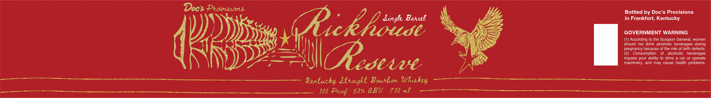

# TTB COLA Label Images - TTBID 26273001000057

**Brand Name:** DOC'S PROVISIONS

**Fanciful Name:** RICKHOUSE RESERVE

**Issue Date:** 10/05/2026

**Origin Code:** 22

**Product Class/Type:** 101

**Source:** [TTB Public COLA Registry](https://ttbonline.gov/colasonline/viewColaDetails.do?action=publicFormDisplay&ttbid=26273001000057)

## Label Images

### Label 1

## Extracted Label Text

*Text extracted via OCR - may contain errors*

**Detected Proof:** 100

### Label 1

Doe's Prowrsionn

Bottled by Doc’s Provisions

in Frankfort, Kentucky

dingk Barwl

\

N

SY

GOVERNMENT WARNING

tOMMAE

Dye

oY

SSS

ZK

(1) According to the Surgeon General, women

y

should not drink alcoholic beverages during

ef Mme

pregnancy because of the risk of birth defects.

se),

(2) Consumption of alcoholic beverages

— xem —-4,

impairs your ability to drive a car or operate

1

machinery, and may cause health problems.

TN

|Receve

Kertuchy Strarcht Bourbon Whiskey ———_

100 Proof | 50% ABV | 700 mL
