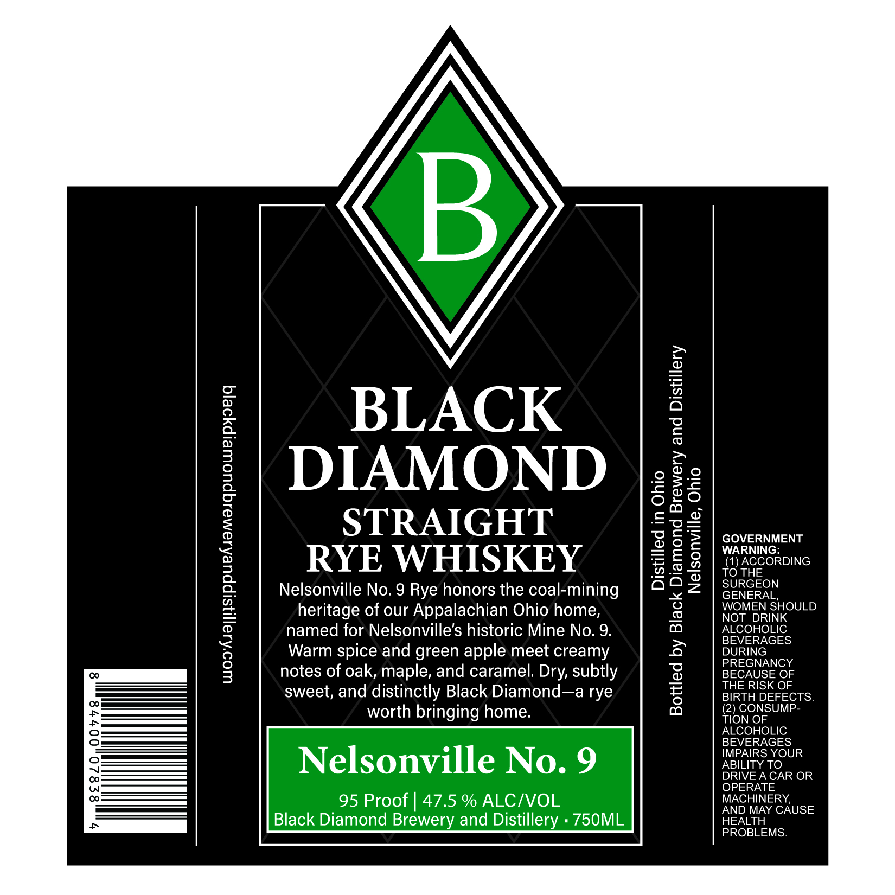

# TTB COLA Label Images - TTBID 26273001000310

**Brand Name:** BLACK DIAMOND BREWERY AND DISTILLERY

**Fanciful Name:** BLACK DIAMOND NELSONVILLE NO. 9

**Issue Date:** 10/07/2026

**Origin Code:** 09

**Product Class/Type:** 102

**Source:** [TTB Public COLA Registry](https://ttbonline.gov/colasonline/viewColaDetails.do?action=publicFormDisplay&ttbid=26273001000310)

## Label Images

### Back Label

## Extracted Label Text

*Text extracted via OCR - may contain errors*

**Detected Proof:** 95

### Back Label

BLACK

DIAMOND

5oe—

STRAIGHT

GOVERNMENT

SE

WARNING:

Eo

(1) ACCORDING

RYE WHISKEY

TO THE

O22

SURGEON

Nelsonville No. 9 Rye honors the coal-mining

GENERAL,

heritage of our Appalachian Ohio home,

WOMEN SHOULD

ALCOHOLIC

NOT DRINK

named for Nelsonville’s historic Mine No. 9.

BEVERAGES

DURING

Warm spice and green apple meet creamy

PREGNANCY

notes of oak, maple, and caramel. Dry, subtly

BECAUSE OF

THE RISK OF

sweet, and distinctly Black Diamond—a rye

BIRTH DEFECTS.

(2) CONSUMP-

worth bringing home.

TION OF

ALCOHOLIC

BEVERAGES

IMPAIRS YOUR

ABILITY TO

Nelsonville No. 9

DRIVE ACAR OR

OPERATE

MACHINERY,

95 Proof | 47.5 % ALC/VOL

AND MAY CAUSE

Black Diamond Brewery and Distillery « 750ML

HEALTH

PROBLEMS.
