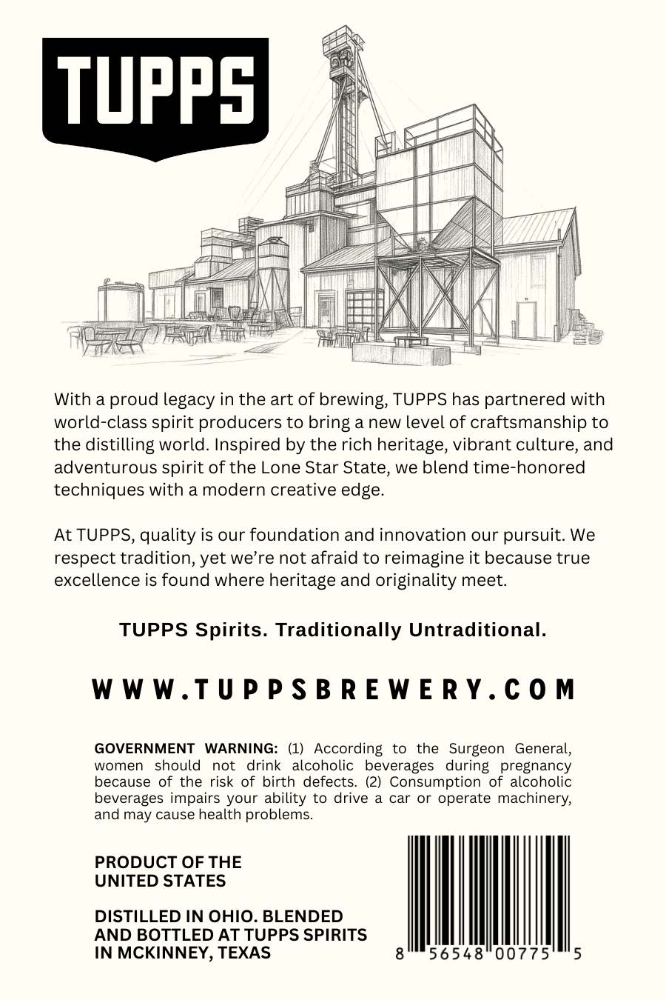
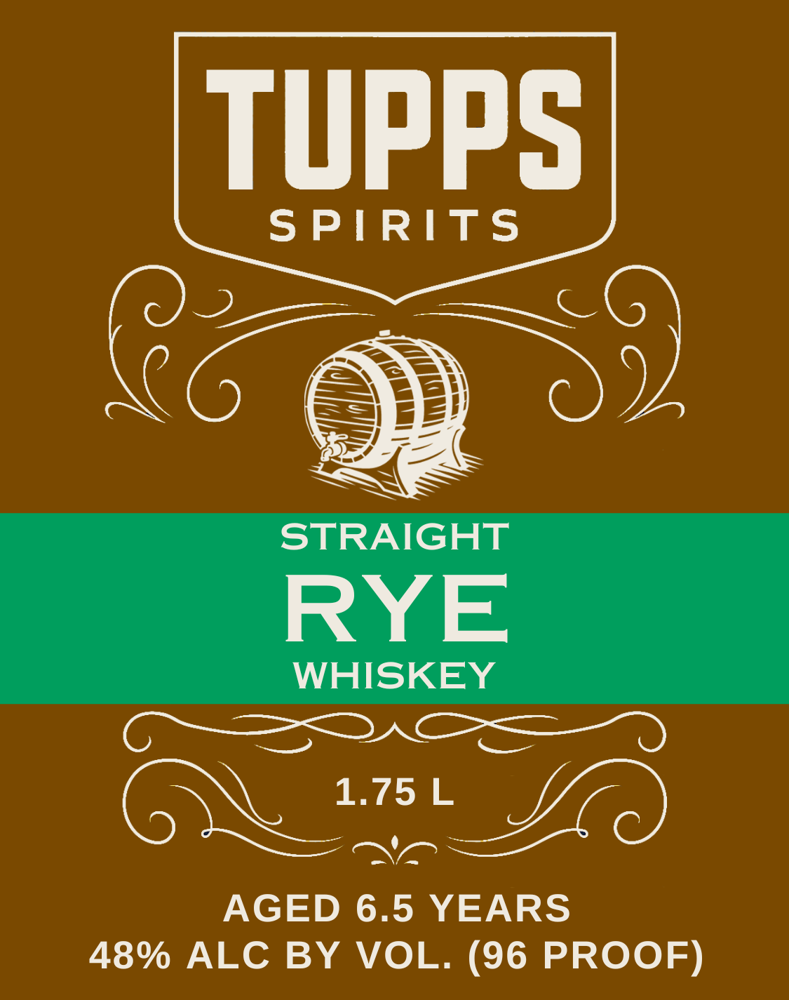

# TTB COLA Label Images - TTBID 26273001000407

**Brand Name:** TUPPS SPIRITS

**Issue Date:** 10/07/2026

**Origin Code:** 44

**Product Class/Type:** 102

**Source:** [TTB Public COLA Registry](https://ttbonline.gov/colasonline/viewColaDetails.do?action=publicFormDisplay&ttbid=26273001000407)

## Label Images

### Back Label

### Label 1

## Extracted Label Text

*Text extracted via OCR - may contain errors*

**Detected Proof:** 96
**Detected Age:** 6.5 Years

### Back Label

\

H

UPP

I

/

ff

ye

Lote

S

pez

ol

VJ

NTA

I

fy

)

AV

Tat

asia

Hamat

iz

a

j=

With a proud legacy in the art of brewing, TUPPS has partnered with

world-class spirit producers to bring a new level of craftsmanship to

the distilling world. Inspired by the rich heritage, vibrant culture, and

adventurous spirit of the Lone Star State, we blend time-honored

techniques with a modern creative edge.

At TUPPS, quality is our foundation and innovation our pursuit. We

respect tradition, yet we’re not afraid to reimagine it because true

excellence is found where heritage and originality meet.

TUPPS Spirits. Traditionally Untraditional

WWW.TUPPSBREWERY.COM

GOVERNMENT WARNING

(1) According to the Surgeon General,

women should not drink alcoholic beverages during pregnancy

because of the risk of birth defects. (2) Consumption of alcoholic

beverages impairs your ability to drive a car or operate machinery,

and may cause health problems.

PRODUCT OF THE

UNITED STATES

DISTILLED IN OHIO. BLENDED

AND BOTTLED AT TUPPS SPIRITS

III

KINNEY,

### Label 1

tupPS
SPIRITS
STRAIGHT
RYE
WHISKEY
OZ
1.75 L
AGED 6.5 YEARS
48% ALC BY
VOL. (96 PROOF)
