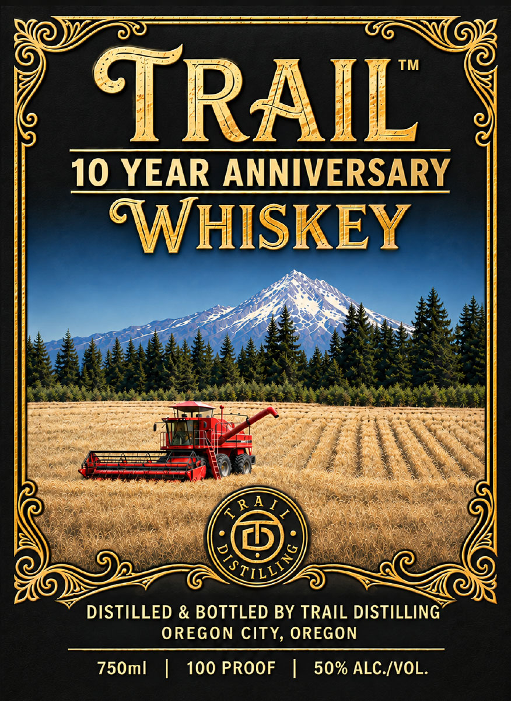
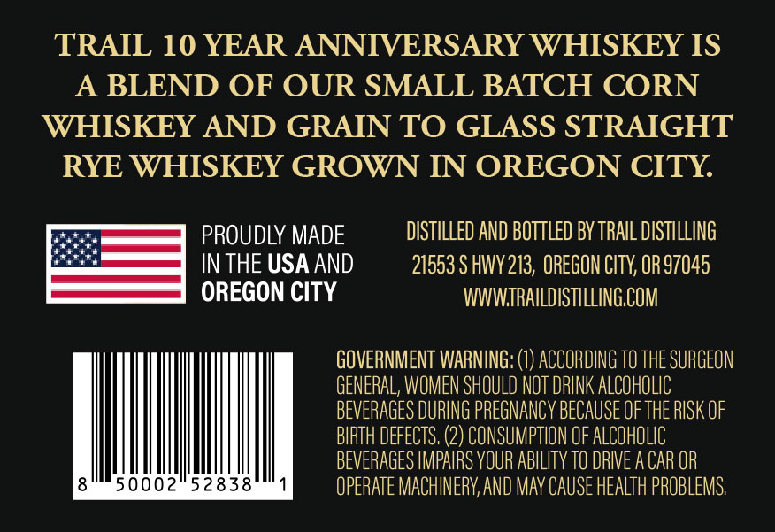

# TTB COLA Label Images - TTBID 26273001000663

**Brand Name:** TRAIL DISTILLING

**Fanciful Name:** 10 YEAR ANNIVERSARY WHISKEY

**Issue Date:** 10/05/2026

**Origin Code:** 38

**Product Class/Type:** 140

**Source:** [TTB Public COLA Registry](https://ttbonline.gov/colasonline/viewColaDetails.do?action=publicFormDisplay&ttbid=26273001000663)

## Label Images

### Label 1

### Label 2

## Extracted Label Text

*Text extracted via OCR - may contain errors*

**Detected Proof:** 100
**Detected Age:** 10 Years

### Label 1

MOST —<“i<‘“<“uaé‘é CO; SDL
G@) ye om ©,
10 YEAR ANNIVERSARY
Pe ee 5 ibn a mn * seithahaetale yeritg Stns Hten tye:
= - * 7 aoe = = : Shs = ——, a
N\ MeN pees.” AE (©) o \\ age : ae . Rane ay L,
Or LZ 7 SOR
DISTILLED & BOTTLED BY TRAIL DISTILLING
OREGON CITY, OREGON
750ml | 100 PROOF | 50% ALC./VOL.

### Label 2

TRAIL 10 YEAR ANNIVERSARY WHISKEY IS

A BLEND OF OUR SMALL BATCH CORN

WHISKEY AND GRAIN TO GLASS STRAIGHT

RYE WHISKEY GROWN IN OREGON CITY.

ists

ates

PROUDLY MADE

ISTILLED AND BOTTLED BY TRAIL DISTILLING

ee

a

IN THE USA AND

21553 S HWY 213, OREGON CITY, OR 97045

OREGON CITY

WWWIRAILDISTILLING.COM

GOVERNMENT WARNING: (1) ACCORDING TO THE SURGEON

GENERAL, WOMEN SHOULD NOT DRINK ALCOHOLIC

BEVERAGES DURING PREGNANCY BECAUSE OF THE RISK OF

BIRTH DEFECTS, (2) CONSUMPTION OF ALCOHOLIC

BEVERAGES IMPAIRS YOUR ABILITY

IVE ACAR OI

8

5000252838

1

OPERATE MACHINERY, AND MAY CAUSE HEALTH PROBLEMS,
