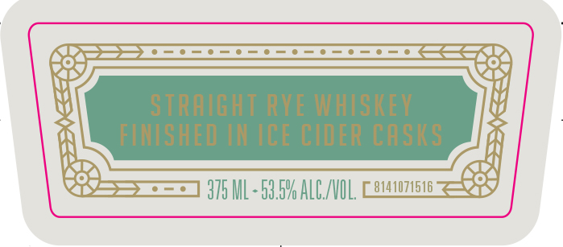
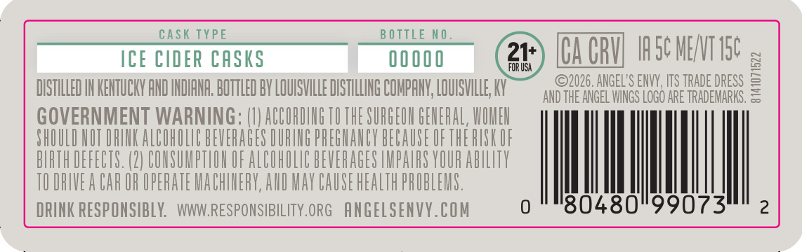
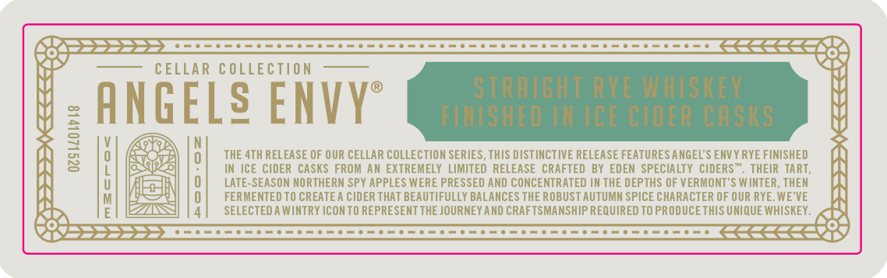

# TTB COLA Label Images - TTBID 26273001000732

**Brand Name:** ANGELS ENVY

**Fanciful Name:** CELLAR COLLECTION

**Issue Date:** 10/07/2026

**Origin Code:** 22

**Product Class/Type:** 102

**Source:** [TTB Public COLA Registry](https://ttbonline.gov/colasonline/viewColaDetails.do?action=publicFormDisplay&ttbid=26273001000732)

## Label Images

### Label 1

### Label 2

### Label 3

### Label 4

### Label 5

### Label 6

## Extracted Label Text

*Text extracted via OCR - may contain errors*

*1 image(s) excluded: text did not meet readability threshold*

### Label 1

FROM ThE CELLARS OF
Tacol SQbndowan
AMGELg ENVV
CELLAR COlectaon

### Label 2

STRAIGHT RYE WHISKEV
FINISHED IN ICE CIDeR CASIS
375 ML- 58.5V ALC/NUL
8141074616

### Label 3

VOLUME MO: 00 4
WOLuMe Mo:004
CELLAR Collection
AMGELS ENVVe
N081911109. 401110
J00"0uiwToa
28406074618
# 0 0F@Waiw@TOa

### Label 4

cask TYPE
B OTTLE NO
ICE CIDER CASKS
00000
21+
CACBU Isc MENT ISc
FOR USA
DISTHLLED IN KENTUCKY AND INDIAHA. BOTTLED BY LOUISVILLE DISTILLING COMPAHK; LQUISVILLE KY
92026. ANGEL'S ENVY, ITS TRADE DRESS
AND THE ANGEL WNGS LOGO ARE TRADEMARKS.
GOVERNMENT WARNING: (UJ ACCORIING TU THE SURGEUH GEHERAL, WUMEU
SHOULD UOT DRIUK ALCOHOLIC BEVERAGES DURING PREGHAUCY BECAUSE UFTHE HUSK UF
BIRTH DEFECTS. (2| COUSUMPTLOH OF ALCOHOLIC BEVERAGES HMPARS YOUR AbILITY
TU DRIVE A CAR OR UPERATE MACHIERY,AHD MAY CAUSE HEALTH PROBLEMS,
DRINK RESP ONSIBLK:
WWWRESPONSIBILITY.ORG   ANGELSENVY.COM
0
'80480"99073
2

### Label 5

CELLAR C OLLECTION
STRAIGHT RVE WHISKey
ANGELS ENVY
FLNTSHED IN ICE CIdER CASIS
3
0
THE 4TH RELEASE OF OUR CELLAR COLLECTION SERIES, THIS DIST INCT IVE RELEASE FEATURES ANGEL'S ENVY RYE FINISHED
IN ICE CIDER  CASKs FROM AN EXTREMELY   LIMITEd RELEASE CRAFTED
BY EDEN  SPECIALTY
CIDERS" . THEIR   TART,
U
LATE-SEASON MORTHERN SPY APPLES WERE PRESSED AND CONCENTRATED IN THE DEPTHS OF VERMONT'$ W INTER, THEM
FERMENTED TO CREATE A CIDER THAT BEAUTIFULLY BALANCES THE ROBUST AUTUMM SPICE CHARACTER OF OUR RYE. WE'VE
SELECTED A WINTRY ICONTO REPRESENT THE JOURNEY AND CRAFTSMANSHIP REQUIRED TO PRODUCETHIS UNIQUE WHISKEY .
