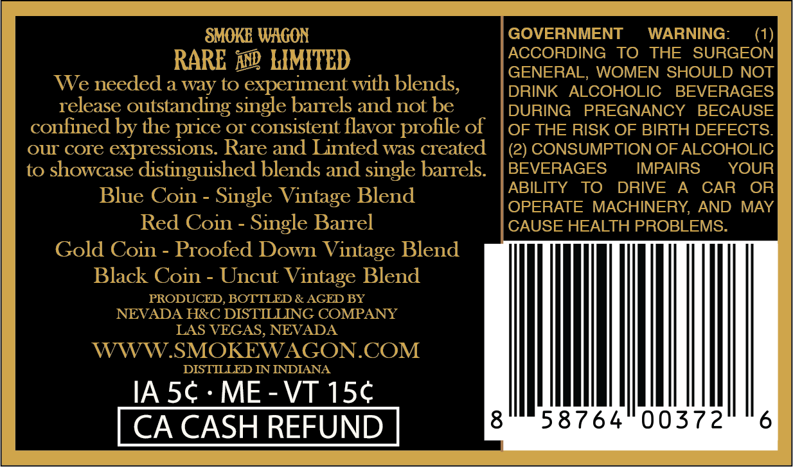
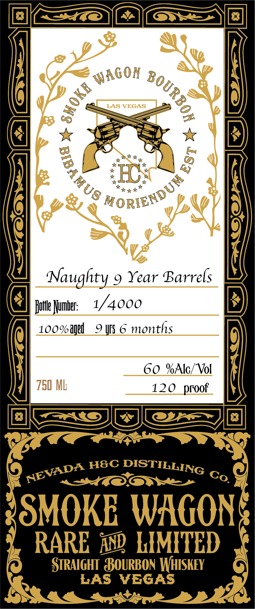

# TTB COLA Label Images - TTBID 26273001000749

**Brand Name:** SMOKE WAGON

**Fanciful Name:** RARE AND LIMITED NAUGHTY 9 YEAR BARRELS

**Issue Date:** 10/05/2026

**Origin Code:** 32

**Product Class/Type:** 101

**Source:** [TTB Public COLA Registry](https://ttbonline.gov/colasonline/viewColaDetails.do?action=publicFormDisplay&ttbid=26273001000749)

## Label Images

### Back Label

### Label 1

## Extracted Label Text

*Text extracted via OCR - may contain errors*

**Detected Proof:** 120
**Detected Age:** 9 Years

### Back Label

SMOKE WAGON
GOVERNMENT
WARNING:
RARE `n LIMITED
ACCORDING
TO
THE
SURGEON
GENERAL,
WOMEN SHOULD NOT
We needed a way to
experiment with blends,
DRINK
ALCOHOLIC
BEVERAGES
release outstanding single barrels and not be
DURING
PREGNANCY
BECAUSE
confined by the
Or consistent flavor
profile of
OF THE RISK OF BIRTH DEFECTS
OUT core expressions. Rare and Limted was created
(2) CONSUMPTION OF ALCOHOLIC
to showcase distinguished blends and single barrels:
BEVERAGES
IMPAIRS
YOUR
ABILITY
TO
DRIVE
A
CAR
OR
Blue Coin
Single Vintage Blend
OPERATE MACHINERY, AND
MAY
Red Coin - Single Barrel
CAUSE HEALTH PROBLEMS:
Gold Coin
Proofed Down Vintage Blend
Black Coin
Uncut Vintage Blend
PRODUCED,BOTTLED & AGED BY
NEVADA HRC DISTILLING COMPANY
LAS VEGAS, NEVADA
WWW.SMOKEWAGON.COM
DISTILLED IN INDIANA
IA 5c
ME
VT 15c
CA CASH REFUND
8
58764
00372
price

### Label 1

LAS VEGAS
B
Naughty 9 Year Barrels
Jutle Mumbel:
1/4000
1oo%ag8d
9 !IS 6
months
60 %Alc/ Vol
750 ML
120  proof
H8C
DISTILLING
SMOKE WAGONS
RARE inp LIMITED
StRAIGHT  BOuRBON WHISKEY
LAS
VEGAS
WaGon
1
3
0
5
MORIENDUM
NEVADA
Co:
