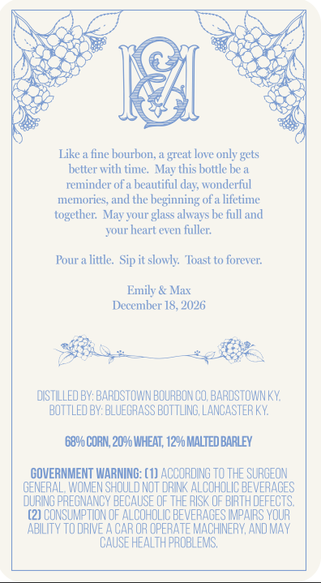
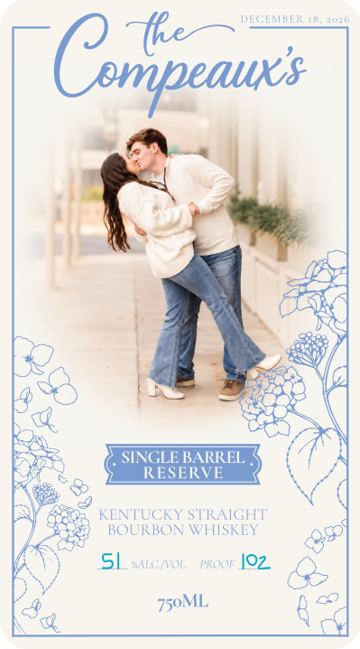

# TTB COLA Label Images - TTBID 26273001000796

**Brand Name:** THE COMPEAUX'S

**Issue Date:** 10/05/2026

**Origin Code:** 22

**Product Class/Type:** 101

**Source:** [TTB Public COLA Registry](https://ttbonline.gov/colasonline/viewColaDetails.do?action=publicFormDisplay&ttbid=26273001000796)

## Label Images

### Back Label

### Front Label

## Extracted Label Text

*Text extracted via OCR - may contain errors*

### Back Label

Like
fine bourbon;
great love only gets
better with time-
this bottle be a
reminder of a beautinul
wonderfal
memories; and the beginning ofa lifetime
together:
your glass always be full and
your heart even fuller:
Pour .
little  Sip it slowly   Toast to forever:
Emily & Max
December 18, '2026
DISTILLED BV: BARDSTOWN BOURBONCO BARDSTOWN KY
BOTTLED BY: BLUEGRASS BOTTLING; LANCASTERKY
6896 CORN, 2096 WHEAT; 1296 MALTED BARLEY
COVERNMENT WARNING: (1) ACCORDING TO THE SURGEON
GENERAL, WoMEN SHOULD NOT DRINK ALCOHOLIC BEVERAGES
DURING PREGNANCY BECAUSE OF THE RISK OF BIRTH DEFECTS
(2) COnSUMPTION OF ALCOHOLIC BEVERAGES IMPAIRS VOUR
AbILITY To DRIVE A CAR OR OPERATE MACHINERY ANDMAY
CAUSE HEALTH PROBLeMS;,
May '
day;"
May

### Front Label

DECEMRER [&
1010
Cmpeauxs
SINGLE BARREL
RESERVE
KENTUCKY STRAIGHT
BOURBON WHISKEY
SL
"Lc KVOL
PROOF [02
750ML
