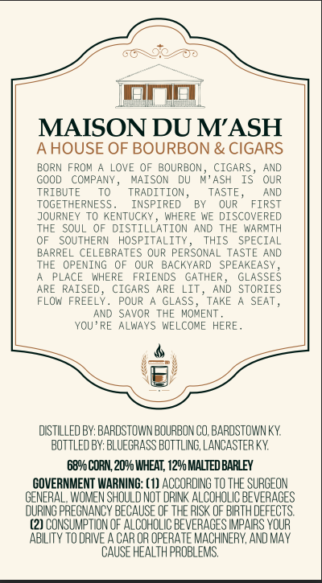
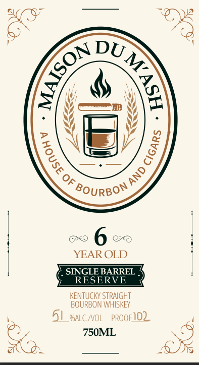

# TTB COLA Label Images - TTBID 26273001000817

**Brand Name:** MADISON DU M'ASH

**Issue Date:** 10/05/2026

**Origin Code:** 22

**Product Class/Type:** 101

**Source:** [TTB Public COLA Registry](https://ttbonline.gov/colasonline/viewColaDetails.do?action=publicFormDisplay&ttbid=26273001000817)

## Label Images

### Back Label

### Front Label

## Extracted Label Text

*Text extracted via OCR - may contain errors*

**Detected Proof:** 102

### Back Label

MAISON DU MASH
AHOUSE OF BOURBON & CIGARS
BORN FROM
LOVE OF BOURBON_
CIGARS
AND
GOOD
COMPANY
MAISON
DU
M'ASH
OUR
TRIBUTE
TRADITION_
TASTE_
AND
TOGETHERNESS _
INSPIRED
QUR
FIRST
JOURNEY
TO KENTUCKY
WHERE WE DISCOVERED
THE
SOUL
DISTILLATION AND THE WARMTH
SOUTHERN
HOSPITALITY _
THIS
SPECIAL
BARREL CELEBRATES OUR PERSONAL TASTE AND
THE
OPENING
OUR
BACKYARD
SPEAKEASY
PLACE
WHERE
FRIENDS
GATHER _
GLASSES
ARE
RAISED
CIGARS ARE
LIT
AND STORIES
FLOW
FREELY
POUR
GLASS _
TAKE
SEAT
AND SAVOR THE
MOMENT
YQU ' RE
ALWAYS WE
COME HERE_
distllLeO Bv: BARDSTOWN BOURBON CO, BARDSTOWN KY
BottleO BV: BLuEGRASS EOTTLING, LANCASTER KY
6896 CORN 2096 WHEAT, 129_ MALTED BARLEY
GOVERNMENT WARNING: (1) ACCORDING TO THE SURGEON
GENERAL; WOMEN SHOULD NOT DRINK ALCOHOLIC BEVERAGES
OURING PREGNANCY BECAUSE OF THE RISK OF BIRTH DEFECTS
(2) CONSUMPTION OF ALCOHOLIC BEVERAGES IMPAIRS YOUR
ABILITY to DRIVE A CAR OR OPERATE MACHINERY, AND MAY
CAUSE HEALTH pROBLemS;

### Front Label

Of
BOURBON
YEAR OLD
SINGLE BARREL
RESERVE
KeNTUCKY STRAIGHT
BOURBON WHISKEY
51_YALC_NOL   PROOF102
750ML
DU_
(
1
1
1
AND '
