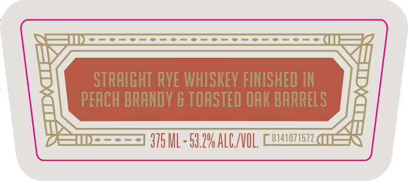
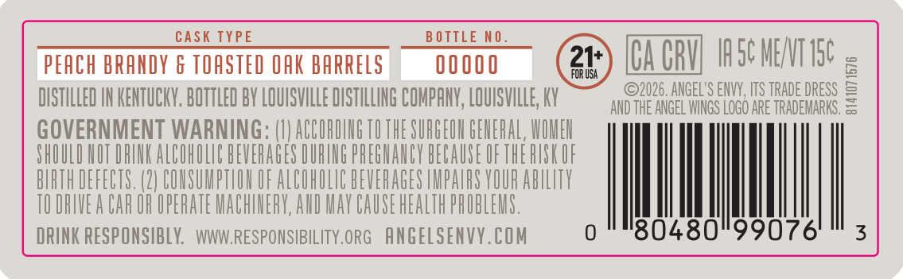
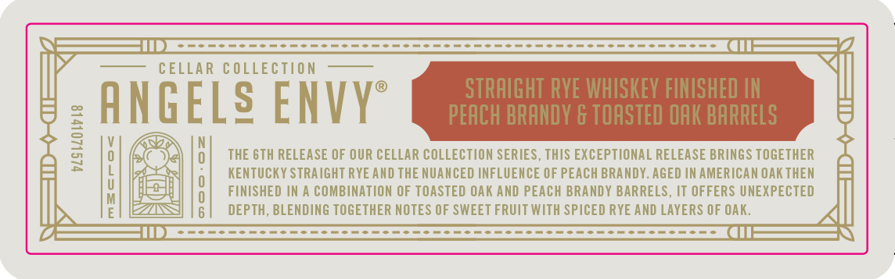

# TTB COLA Label Images - TTBID 26273001000882

**Brand Name:** ANGELS ENVY

**Fanciful Name:** CELLAR COLLECTION

**Issue Date:** 10/07/2026

**Origin Code:** 22

**Product Class/Type:** 102

**Source:** [TTB Public COLA Registry](https://ttbonline.gov/colasonline/viewColaDetails.do?action=publicFormDisplay&ttbid=26273001000882)

## Label Images

### Label 1

### Label 2

### Label 3

### Label 4

### Label 5

### Label 6

## Extracted Label Text

*Text extracted via OCR - may contain errors*

*1 image(s) excluded: text did not meet readability threshold*

### Label 1

FROM ThE CELLARS OF
Tacol SQbndowan
AMGELg ENVV
CELLAR COlectaon

### Label 2

STRAIGHT RYE WHISKEY FINISHED IN
PEACH BRANDY & TOASTED OAK BARRELS
375 ML - 53.20 ALC/VOL;
8141074672

### Label 3

VOLUME NO . 006
VOLUME RO . 00 6
CELLAR COLLEction
ANGELS ENVYE
N0I1J37103 481173
900 "O8 JNOIOA
8141071570
900 "On 1NOIOA

### Label 4

CASK TYPE BOTTLE NO.
PEACH BRANDY & TOASTED OAK BARRELS 00000 CA CRV IASC MENT TSE
DISTILLED IN KENTUCKY. BOTTLED BY LOUISVILLE DISTILLING COMPANY, LOUISVILLE, KY yee ee TRE
GOVERNMENT WARNING: (1) ACCORDING 10 THE SURGEON GENERAL, WOME
SHOULD NOT DRINK ALCOROLUC BEVERAGES DURING PREGNANCY BECAUSE OFTHE RISK OF
BIATH DEFECTS. (2) COUSUMPTION OF ALCOHOLIC BEVERAGES IMPAIFS YOUR ABILITY
TODRIVEA CAR OR OPERATE MACHINERY, AND MAY CAUSE HEALTH PROBLEMS.
DRINK RESPONSIBLY. WWWRESPONSIBILITY.ORG ANGELSENVY.cOoM © 80480°99076 © 3

### Label 5

CELLAR €OLLECTION
STRAIGHT RYE WHISKEY FINISHED IN
ANGELS ENVY
PEACH BRANDY & TOASTED OAK BARRELS
1
0
THE GTH RELEASE OF OUR CELLAR COLLECTION SERIES, THIS EXCEPTIONAL RELEASE BRINGS TOGETHER
6
KENTuCKY STRAIGHT RYE AND THE NUANCED INFLUENCE OF PEACH BRANDY. AGED IN AMERICAN OAKTHEN
FINISHED IN
COMBINATION OF TOASTED OAK And PEACH BRANDY BARRELS, IT OFFERS UNEXPECTED
DEPTH, BLENDING TOGETHER NOTES OF SWEET FRUIT WITH SPICED RYE AND LAYERS OF OAK
