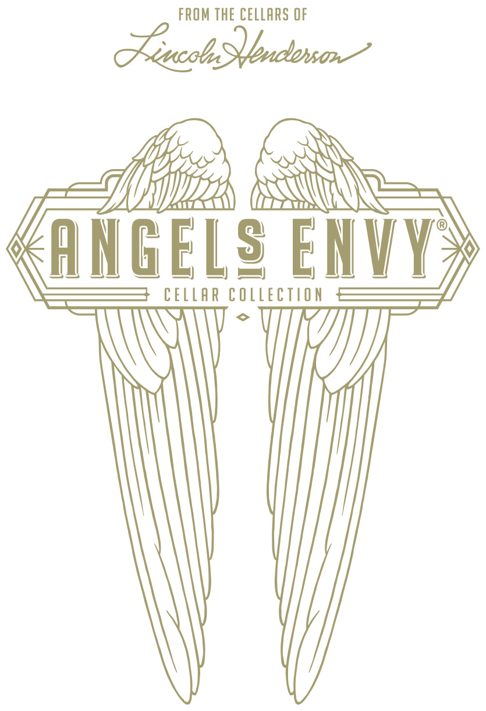
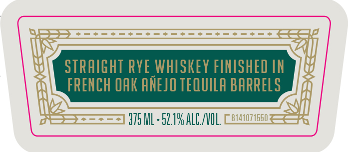
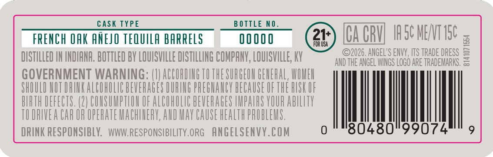
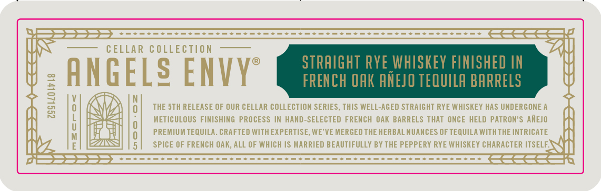
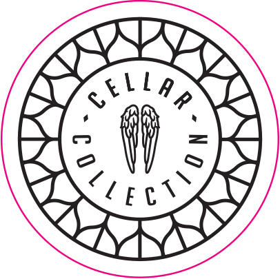

# TTB COLA Label Images - TTBID 26273001000891

**Brand Name:** ANGELS ENVY

**Fanciful Name:** CELLAR COLLECTION

**Issue Date:** 10/06/2026

**Origin Code:** 22

**Product Class/Type:** 102

**Source:** [TTB Public COLA Registry](https://ttbonline.gov/colasonline/viewColaDetails.do?action=publicFormDisplay&ttbid=26273001000891)

## Label Images

### Label 1

### Label 2

### Label 3

### Label 4

### Label 5

### Label 6

## Extracted Label Text

*Text extracted via OCR - may contain errors*

*1 image(s) excluded: text did not meet readability threshold*

### Label 1

FROM ThE CELLARS OF
Tacol SQbndowan
AMGELg ENVV
CELLAR COlectaon

### Label 2

STRAIGHT RYE WHISKEY FINISHED IN
FRENCH OAK ANEJO TEQUILA BARRELS

STG ML $2.14 ALCVOL

### Label 3

YY

UU

1d

U

ah

ECCELLAR COLLECTION | #{ ANGELS ENVY

m

miiskia wna}

ih

### Label 4

cask TYPE
B O TTLE NO _
FRENCH QAK ANEJO TEQUILA bARRELS
00 000
21+
[ACRU IScMENT I5c z
FOR USA
DISTILLED IN INDIANA. BOTTLED BY LQUISVILLE DISTILLING COMPANY, LOUISVLLE; KY
92026. ANGEL'S ENVV , ITS TRADE DRESS =
AND THE ANGEL WINGS LOGO ARE TRADEMARKS,
GOVERNMENT WARNING: (V ACGORDIHGTOTHESURGEOH GEHERAL, WOHEH
SHOULD HUT DRIK ALCOHULIC BEVERAGES DURING PREGHANLY BECAUSE UFTHE HUSK UF
BIRTH DEFECTS. (2| COHSUMPTLOH OF ALBOHOLIC BEVERAGES IMPARS VOUR AbILTY
TU DRIVEA CAR OR OPERATE MACHIHERY,AHD MAY CAUSE HEALTH PROBLEMS .
DRINK RESPONSIBLY:
WWWRESPONSIBILITY.ORG
ANGELSENVY.COM
0
'80480"99074

### Label 5

CELLAR
COLLECTION
STRAIGHT Rye whiSKeY FINISHED IN
ANGELS ENVyS
FRENCH OAK ANEJO TEQUILA BARRELS
1
THE sth RELEASE OF QUR CELLAR COLLECTION SERIES, THIS WELL-AGED STRAIGHT RYE WHISKEY HAS UNDERGONE A
METICULOUS FinISHING PROCESS IN HAND-SELECTED FREMCH Oak BARRELS ThAt ONCE HELD PATRON'S  AMEJO
PREMIUM TEQUILA. CRAFTED WITHEXPERTISE; WE'VE MERGEDTHE HERBAL NUANCES OF TEQUILA WITHTHE INTRICATE
SPICE OF FRENCH OAK; ALL OF WHICH /S MARRIED BEAUTIFULLY BY THE PEPPERY RYE WHISKEY CHARACTER ITSELF;
