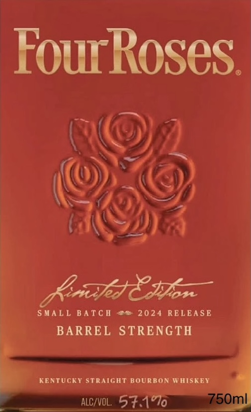
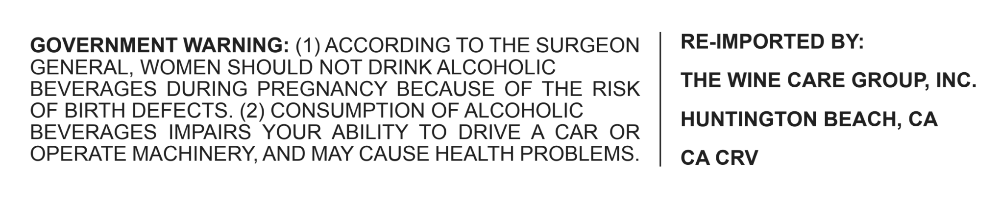

# TTB COLA Label Images - TTBID 26273001000925

**Brand Name:** FOUR ROSES

**Fanciful Name:** SMALL BATCH 2024

**Issue Date:** 10/06/2026

**Origin Code:** 22

**Product Class/Type:** 101

**Source:** [TTB Public COLA Registry](https://ttbonline.gov/colasonline/viewColaDetails.do?action=publicFormDisplay&ttbid=26273001000925)

## Label Images

### Front Label

### Label 2

## Extracted Label Text

*Text extracted via OCR - may contain errors*

### Front Label

FourRoses
Anhsczyon
Small Batch
2024 RELEASE
BARREL STRENGTH
KENTUCKY STRAIGHT BOURBON WHISKEY
ALCIVOL
5t1*0
750ml

### Label 2

GOVERNMENT WARNING: (1) ACCORDING TO THE SURGEON

RE-IMPORTED BY:

GENERAL, WOMEN SHOULD NOT DRINK ALCOHOLIC

BEVERAGES DURING PREGNANCY BECAUSE OF THE RISK

THE WINE CARE GROUP, INC.

OF BIRTH DEFECTS. (2) CONSUMPTION OF ALCOHOLIC

BEVERAGES IMPAIRS YOUR ABILITY TO DRIVE A CAR OR

HUNTINGTON BEACH, CA

OPERATE MACHINERY, AND MAY CAUSE HEALTH PROBLEMS.

CA CRV
