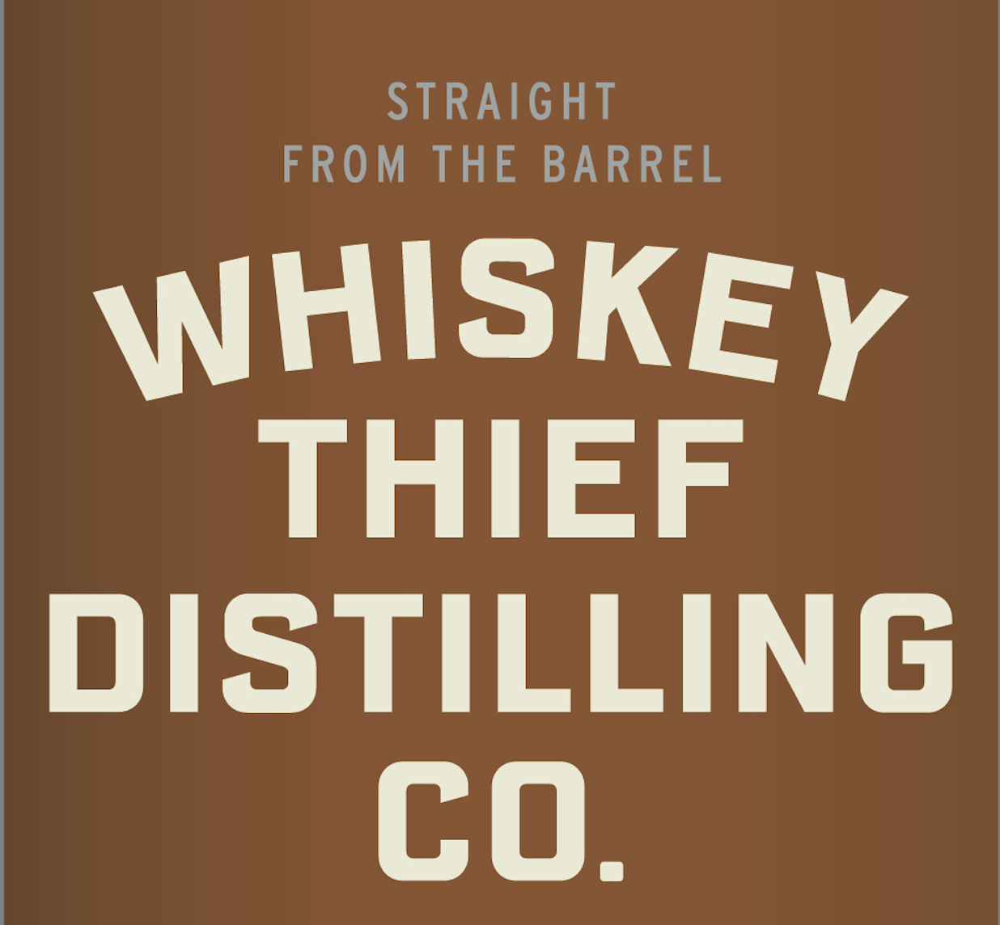
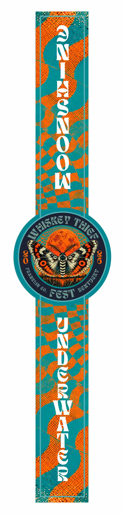
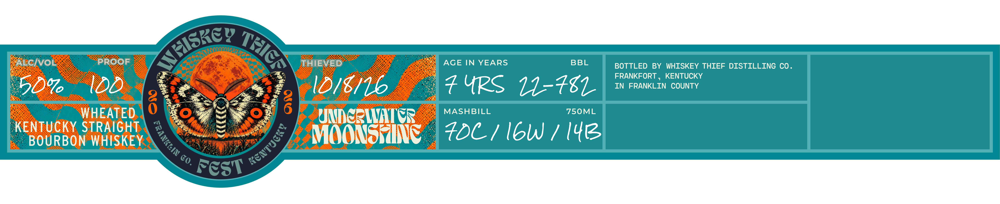

# TTB COLA Label Images - TTBID 26274001000073

**Brand Name:** WHISKEY THIEF DISTILLING CO.

**Fanciful Name:** UNDERWATER MOONSHINE - WHEATED

**Issue Date:** 10/05/2026

**Origin Code:** 22

**Product Class/Type:** 101

**Source:** [TTB Public COLA Registry](https://ttbonline.gov/colasonline/viewColaDetails.do?action=publicFormDisplay&ttbid=26274001000073)

## Label Images

### Label 1

### Label 2

### Label 3

### Label 4

## Extracted Label Text

*Text extracted via OCR - may contain errors*

*1 image(s) excluded: text did not meet readability threshold*

### Label 1

STRAIGHT
FROM
THE
BARREL
WHISKEY
THIEF
DISTILLING
co.

### Label 3

ALcivo
PROOF
THIEVED
AGE IN YEARS
BBL
BOTTLED
BY WHISKEY THIEF DISTILLING CO .
FRANKFORT
KENTUCKY
%6
#4PS 11-481
IN FRANKLIN COUNTY
WHEATED
8
8
UNnC:WICR
MASHBILL
750ML
KEBOURBONSTRHIGHET
Moonseuinc
#DC/ IbW / I41z
Co,
FCST
tiskc)
TEICA
1
1

### Label 4

GOVERNMENT WARNING: (1) ACCORDING TO THE SURGEON

GENERAL, WOMEN SHOULD NOT DRINK ALCOHOLIC

BEVERAGES DURING PREGNANCY BECAUSE OF THE RISK OF

BIRTH DEFECTS.

(2) CONSUMPTION OF ALCOHOLIC

BEVERAGES IMPAIRS YOUR ABILITY TO DRIVE A CAR OR

OPERATE MACHINERY, AND MAY CAUSE HEALTH PROBLEMS.
