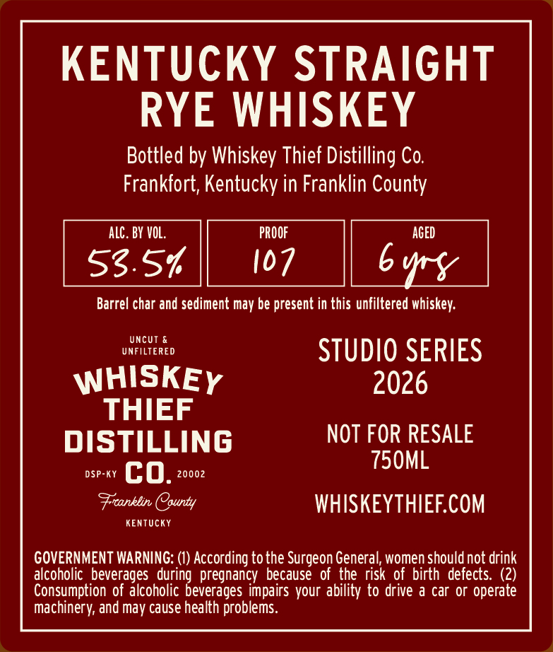
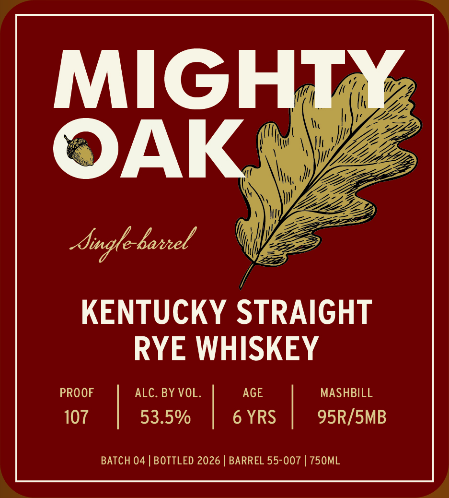

# TTB COLA Label Images - TTBID 26274001000076

**Brand Name:** WHISKEY THIEF DISTILLING CO.

**Fanciful Name:** MIGHTY OAK

**Issue Date:** 10/05/2026

**Origin Code:** 22

**Product Class/Type:** 102

**Source:** [TTB Public COLA Registry](https://ttbonline.gov/colasonline/viewColaDetails.do?action=publicFormDisplay&ttbid=26274001000076)

## Label Images

### Back Label

### Front Label

## Extracted Label Text

*Text extracted via OCR - may contain errors*

**Detected Proof:** 107
**Detected Age:** 6 Years

### Back Label

KENTUCKY STRAIGHT
RYE WHISKEY

Bottled by Whiskey Thief Distilling Co.
Frankfort, Kentucky in Franklin County

53.5% || 107 || byry

Barrel char and sediment may be present in this unfiltered whiskey.

varie STUDIO SERIES

WHISKEy 2026
THIEF

NOT FOR RESALE
misTiLLING

Freanktrn County WHISKEYTHIEF.COM

KENTUCKY

GOVERNMENT WARNING: (1) According to the Surgeon General, women should not drink
alcoholic beverages during pregnancy because of the risk of birth defects. (2)
Consumption of alcoholic beverages impairs your ability to drive a car or operate
Machinery, and may cause health problems.

### Front Label

MIGHT
OAK
Sugle-baneel
KENTUCKY STRAIGHT
RYE WHISKEY
PROOF
ALC. BY VOL.
AGE
MASHBILL
107
53.5%
6 YRS
95R/SMB
BATCH 04
BOTTLED 2026
BARREL 55-007
750ML
