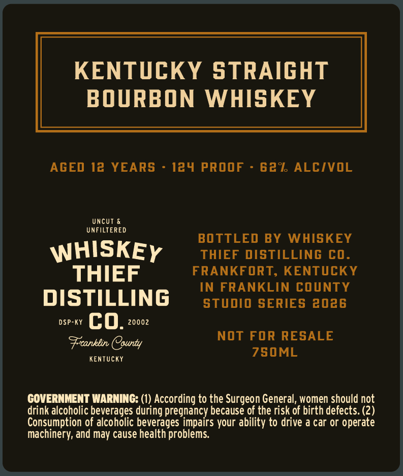
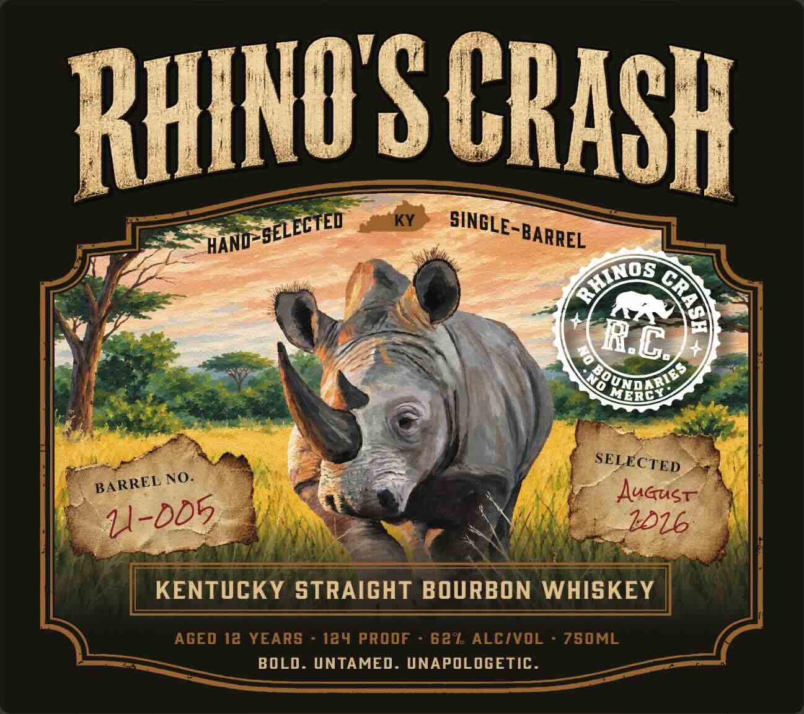

# TTB COLA Label Images - TTBID 26274001000082

**Brand Name:** WHISKEY THIEF DISTILLING CO.

**Fanciful Name:** RHINO'S CRASH

**Issue Date:** 10/06/2026

**Origin Code:** 22

**Product Class/Type:** 101

**Source:** [TTB Public COLA Registry](https://ttbonline.gov/colasonline/viewColaDetails.do?action=publicFormDisplay&ttbid=26274001000082)

## Label Images

### Back Label

### Front Label

## Extracted Label Text

*Text extracted via OCR - may contain errors*

**Detected Proof:** 124
**Detected Age:** 12 Years

### Back Label

KENTUCKY STRAIGHT
BOURBON
WHISKEY
AGED 12 YEARS
124 PROOF
62% ALCIVOL
UncUT
UNFILTERED
BOTTLED BY WHISKEY
WHISKEY
THIEF DISTILLING CO_
THIEF
FRANKFORT, KENTUCKY
IN FRANKLIN COUNTY
DISTILLING
studio SERIES 2026
DSP-KY
co.
20002
NOT FOR RESALE
Frcanklin County
750ML
Kentucky
GOVERNMENT WARNING: (1) According to the Surgeon General, women should not
drink alcoholic beverages during pregnancy because of the risk of birth defects: (2)
Consumption of alcoholic beverages impairs your ability to drive a car or operate
ma
chinery; and may cause health problems

### Front Label

RhINO S CRASH
KY
3
YuNo5nc?,
MERDY
Auaust
1016
KENTUCKY STRAIGHT BOURBON WHISKEY
AGED 12 YEARS
124 PROOF
62% ALCIVOL
ZS0ML
BOLD. UNTAMED. UNAPOLOGETIC .
"SELECTED
SINGLE-BARREL
HAND
HINOS
9
RC
No
SELECTED
NO:
BARREL
I-DD5
