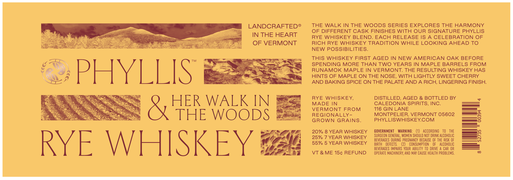
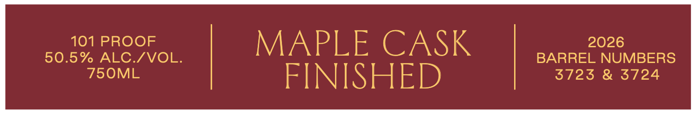
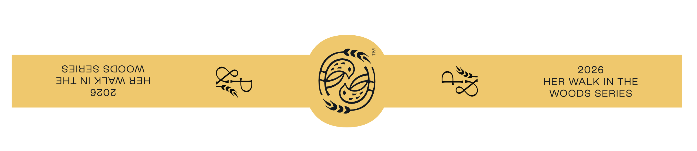

# TTB COLA Label Images - TTBID 26274001000093

**Brand Name:** CALEDONIA SPIRITS

**Issue Date:** 10/07/2026

**Origin Code:** 46

**Product Class/Type:** 142

**Source:** [TTB Public COLA Registry](https://ttbonline.gov/colasonline/viewColaDetails.do?action=publicFormDisplay&ttbid=26274001000093)

## Label Images

### Label 1

### Label 2

### Label 3

## Extracted Label Text

*Text extracted via OCR - may contain errors*

**Detected Proof:** 101
**Detected Age:** 8 Years

### Label 1

LANDCRAFTED
THE WALK IN THE WOODS SERIES EXPLORES THE HARMONY
OF DIFFERENT CASK FINISHES WITH OUR SIGNATURE PHYLLIS
IN THE HEART
RYE WHISKEY BLEND. EACH RELEASE IS A CELEBRATION OF
OF VERMONT
RICH RYE WHISKEY TRADITION WHILE LOOKING AHEAD TO
NEW POSSIBILITIES.
THIS WHISKEY FIRST AGED IN NEW AMERICAN OAK BEFORE
TM
SPENDING MORE THAN TWO YEARS IN MAPLE BARRELS FROM
PHYLLIS
RUNAMOK MAPLE IN VERMONT: THE RESULTING WHISKEY HAS
HINTS OF MAPLE ON THE NOSE, WITH LIGHTLY SWEET CHERRY
AND BAKING SPICE ON THE PALATE AND A RICH, LINGERING FINISH:
RYE
WHISKEY,
DISTILLED, AGED & BOTTLED BY
HER WALK IN
MADE IN
CALEDONIA SPIRITS, INC.
VERMONT
FROM
116 GIN LANE
THE
WOODS
REGIONALLY -
MONTPELIER;
VERMONT 05602
8
GROWN
GRAINS_
PHYLLISWHISKEYCOM
20% 8 YEAR WHISKEY
GOVERNMENT
WARNING:
ACCORDING
TO
THE
25% 7 YEAR WHISKEY
SURGEON GENERAL, WOMEN SHOULD NOT DRINK ALCOHOLIC
3
BEVERAGES  DURING   PREGNANCY  BECAUSE  OF THE RISK OF
RYE
WHISKEY
55% 5 YEAR WHISKEY
BIRTH
dEFECTS.
CONSUMPTION
OF
alcohOlIC
BEVERAGES IMPAIRS  YOUR ABILITY TO   DRIVE
A CAR OR
VT & ME 15c REFUND
OPERATE MAChINERY, ANd MAY CAuSe hEALTH PROBLEMS .

### Label 2

101 PROOF
MAPLE CASK
2026
50.5% ALC /VOL:
BARREL NUMBERS
750ML
FINISHED
3723 & 3724

### Label 3

2
s3183S saOOM
2026
JHL NIXIVM &3H
43
HER
WALK IN THE
9z03
WOODS SERIES
x
