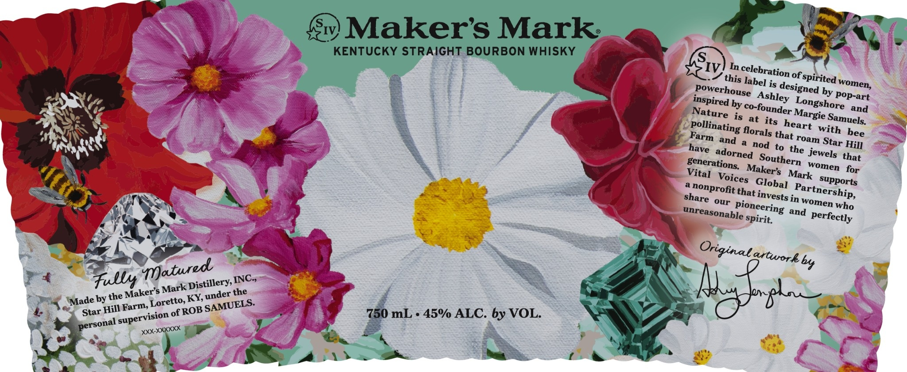
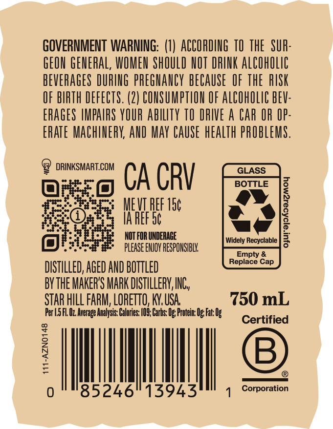

# TTB COLA Label Images - TTBID 26274001000189

**Brand Name:** MAKER'S MARK

**Issue Date:** 10/07/2026

**Origin Code:** 22

**Product Class/Type:** 101

**Source:** [TTB Public COLA Registry](https://ttbonline.gov/colasonline/viewColaDetails.do?action=publicFormDisplay&ttbid=26274001000189)

## Label Images

### Label 1

### Label 2

## Extracted Label Text

*Text extracted via OCR - may contain errors*

**Detected Proof:** 90

### Label 1

S
'IV}
Makers Mark
KENTUCKY STRAIGHT BOURBON WHISKY
S
IV
In
this label
of
spirited
is
by pop-art
by
and
is
at its
and
nod
to
Hill
the jewels
generations;
Mark
supports
nonprofit that_
our
in
who
and
spirit
grtwork by
Fullys
Mark
the
by the
oALE
Star Hill Farm;
of
750 mL . 45% ALC. by VOL:
celebration
women,
designed
powerhouse
Ashley
inspired
Longshore
co-founder
Nature
Margie
Samuels:
heart
pollinating
with
florals
bee
Farm
that
roam
Star
have
adorned
Southern
that
women
Maker s
for
Vital
Voices
Global
Partnership,
invests
share
women
pioneering
unreasonable
perfectly
Oriqinal ;
Jatured
INC ,
Distillery,
Maker' $
under
KY
Made
Loretto,
SAMUELS:
ROB
supervision
personal
XXXXXX

### Label 2

GOVERNMENT WARNING: (1) ACCORDING TO THE  SUR:
GEON GENERAL, WOMEN ShOULD NOT DRINK AlCohOlic
BEVERAGES DURING prEGhaNCY BECAUSE   OF ThE  RISK
OF BIRTH DEFECTS. (2) CONSUMPTHON OF AlCOhOLIc BEV:
ERAGES IMPAIRS YOUR abilTy TO DRIVE a Car OR IP:
ERATE MAChIERY; AND May CAUSe hEalth PROBLEMS.
DRINKSMART.COM
GLASS
CA CRV
BOTTLE
MEVI PEF 15c
7
IA REF 5c
NOT FOR UNDERAGE
Widely Recyclable
3
please ENJOY RESPONSIBL
Empty &
Replace Cap
DISTILLED; AGED AND BOTTLED
bYthE MAKER'S MARK DISTILLERV,INC,
STAR HILL FARM; LORETTO, KN, USA
750 mL
Fer |5 FL Uz Average Analysis: Calbries: /O9; Carbs: Ug; Frotein Ug Fat: Ug
Certified
7
B
0
85246
13943
Corporation
