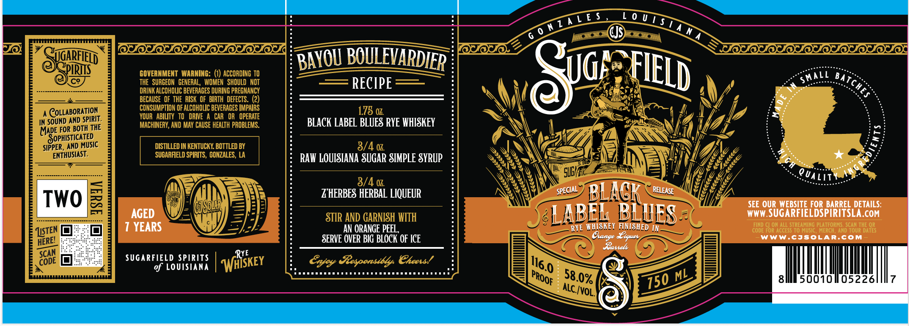

# TTB COLA Label Images - TTBID 26274001000211

**Brand Name:** SUGARFIELD

**Fanciful Name:** BLACK LABEL BLUES

**Issue Date:** 10/06/2026

**Origin Code:** 23

**Product Class/Type:** 142

**Source:** [TTB Public COLA Registry](https://ttbonline.gov/colasonline/viewColaDetails.do?action=publicFormDisplay&ttbid=26274001000211)

## Label Images

### Label 1

## Extracted Label Text

*Text extracted via OCR - may contain errors*

### Label 1

"Tgnrfield
BOULEVARDIeR
PIRIS
GOVERNMENT  WARNING: (1) ACCORDING TO
Sig;;
BaT
THE   SURGEON   GENERAL, WOMEN   SHOULD   NOT
RECIPE
DRINK ALCOHOLC BEVERAGES DURING PREGNANCY
BECAUSE  OF THE  RISK  OF BIRTH  DEFECTS. (2)
COLLABORATION
CONSUMPTION OF ALCOHOLIC BEVERAGES IMPAIRS
178 0
SPIRIT .
VOUR   ABILITY   TO   DRIE 4 CAR  OR   OPERATE
IN SOUND AND
THE
MACHINERY, AND MAY CAUSE HEALTH PROBLEMS:
BLACK LABEL BLUES RYE WHISKEY
MADE FOR BOtH
SoPHISTIcATED_
SIPPER , AND MUSIC
DISTILLED IN KENTUCKY BOTTLED BY
3/4 0
ENTHUSIAST .
SUGARFELD SPIRITS , GONZALES, LA
RAV LOUISIANA SUGAR SIMPLE SYRUP
SULU
LIT
3/4 0
TWO
ZHERBES HERBAL LIQUEUR
BLACR
ISoUL
SEE OUR WEBSITE FOR BARREL DETAILS:
AGED
STIR AND GARNISH WITH
LABEG BLUESA
WWW SUGARFIELDSPIRITSLA.COM
YEARS
AN ORANGE PEEL
RYE WHISKEY FLNISHED IN
FIND CI ON ALL STREAMING PLATFORNS: SCAN THE QR
ILSTEN
CODE FOR ACCESS TO MUSIC,
MERCH , AND TOUR DATES
SERVE OVER BIG BLOCK OF ICE
Lange
Eiquel
WWw'CJSOLaR.coM
fawels
SUGARFIELD SPIRITS
WFSkEy
RYE
Erjoy  esponsibly C@heets!
of LoUiSIANA
ML
8
500101/05226
ALC_/voL_
TZ4[ € $
7 0 ULSUA MA
BAYOU
FIELD
SMALL
CHES
0
QUa
SPECIAL
RELEASE
HERE!
SCAN
116.0
CODE
58.0% !
PROOF
750
