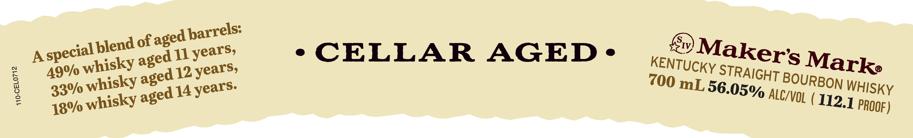
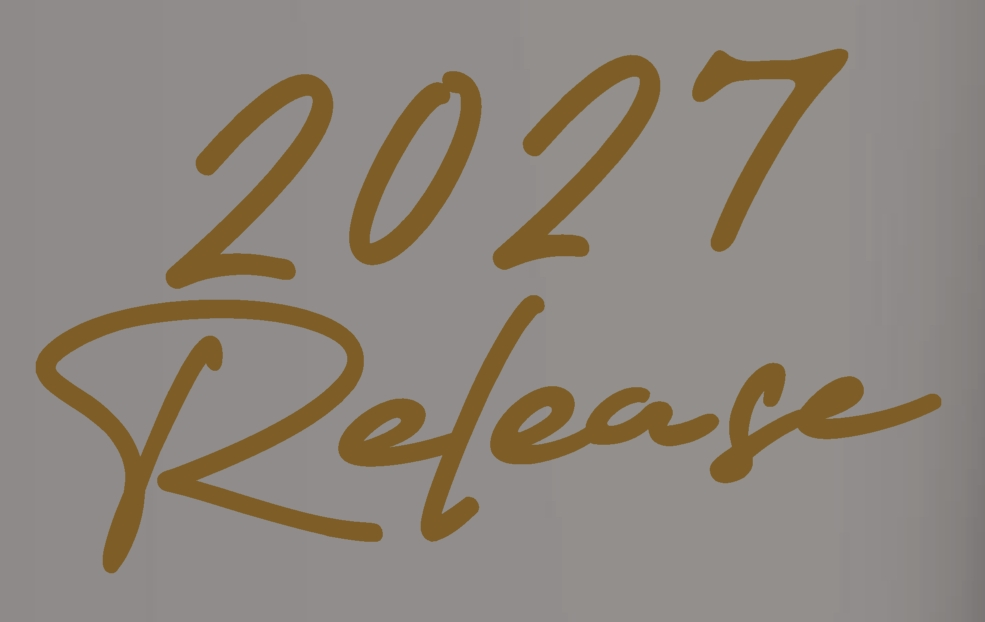
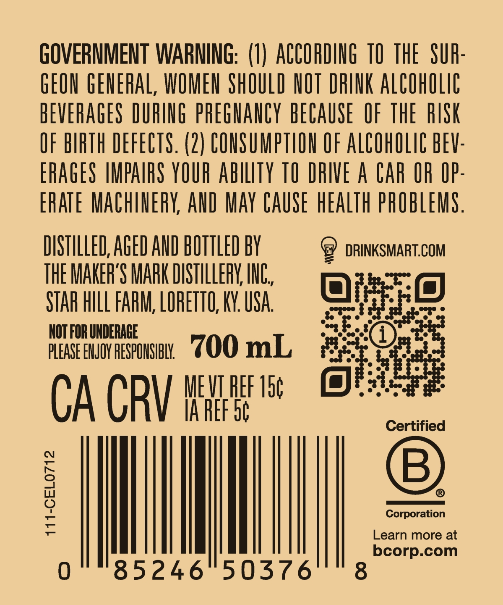

# TTB COLA Label Images - TTBID 26274001000223

**Brand Name:** MAKER'S MARK

**Issue Date:** 10/07/2026

**Origin Code:** 22

**Product Class/Type:** 101

**Source:** [TTB Public COLA Registry](https://ttbonline.gov/colasonline/viewColaDetails.do?action=publicFormDisplay&ttbid=26274001000223)

## Label Images

### Label 1

### Label 2

### Label 3

## Extracted Label Text

*Text extracted via OCR - may contain errors*

*1 image(s) excluded: text did not meet readability threshold*

**Detected Proof:** 98

### Label 1

of
A
11
CELLAR
AGED'
whisky
12
whisky
700 mL
14
whisky
barrels:
aged -
blend
Makers
special E
years,
aged
Marke
KENTUCKY
years,
49%
STRAIGHT
1
aged
BOURBON
WHISKY
years:
56.05%
33%/
aged
ALC/VOL
112.1
PROOF )
18%

### Label 3

GOVERNMENT WARNING: (1) ACCORDING T0 THE SUR

GEON GENERAL, WOMEN SHOULD NOT DRINK ALCOHOLIC

BEVERAGES DURING PREGNANCY BECAUSE OF THE RISK

OF BIRTH DEFECTS. (2) CONSUMPTION OF ALCOHOLIC BEV

ERAGES IMPAIRS YOUR ABILITY TO DRIVE A CAR OR OP

ERATE MACHINERY, AND MAY CAUSE HEALTH PROBLEMS

DISTILLED, AGED AND BOTTLED BY

9 DRINKSMART.COM

THE MAKER'S MARK DISTILLERY, INC

STAR HILL FARM, LORETTO, KY. USA.

NOT FOR UNDERAGE

Batis

plcast Ewov aesponsin, 2OO mL

a

CA CRY |

ME VT REF 15¢

IA REF ot

Corporati

Learn more at

I

bcorp.com

85246 503576
