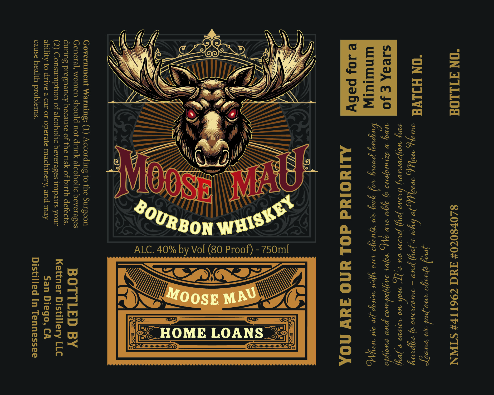

# TTB COLA Label Images - TTBID 26274001000319

**Brand Name:** MOOSE MAU

**Issue Date:** 10/06/2026

**Origin Code:** 01

**Product Class/Type:** 141

**Source:** [TTB Public COLA Registry](https://ttbonline.gov/colasonline/viewColaDetails.do?action=publicFormDisplay&ttbid=26274001000319)

## Label Images

### Label 1

## Extracted Label Text

*Text extracted via OCR - may contain errors*

**Detected Proof:** 80

### Label 1

“ON FTLLOG 82080704 AUC ZI6LIF# STINN

. jee) guaya no ynd aot puvaze
ON HILVa CEG SEGA) acs J» byes 9 Joy pus ~ rucrve0 9) rypuny
pyy woypuruny) pry prow ou 9 Jr mah wo vapve » joy)
LEY EMC 179 2 regirn19 9) 99y 210 44(,, ry saypodruoa pur euryfdo
WNWIUIW Buypuy poorg ve) yoo, 204 hua a v9 yor vuctap jie 204 WY Uy

ALIWOldd dOl UNG AuW NOA

e JO} paby

ALC. 40% by Vol (80 Proof) - 750ml

Government Warning: (1) According to the Surgeon

General, women should not drink alcoholic beverages

during pregnancy because of the risk of birth defects. B OTTL ED BY
(2) Consumption of alcoholic beverages impairs your Kettner Distillery LLC
ability to drive a car or operate machinery, and may San Diego, CA

cause health problems. Distilled In Tennessee
