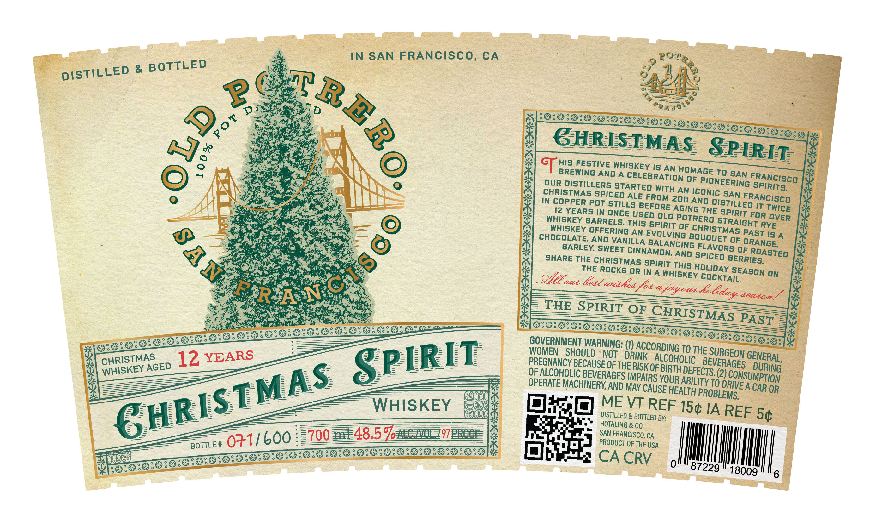
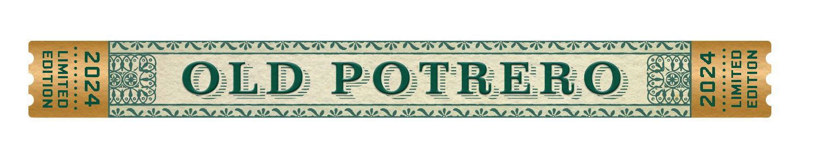

# TTB COLA Label Images - TTBID 26274001000378

**Brand Name:** OLD POTRERO

**Issue Date:** 10/06/2026

**Origin Code:** 01

**Product Class/Type:** 140

**Source:** [TTB Public COLA Registry](https://ttbonline.gov/colasonline/viewColaDetails.do?action=publicFormDisplay&ttbid=26274001000378)

## Label Images

### Label 1

### Label 2

## Extracted Label Text

*Text extracted via OCR - may contain errors*

*1 image(s) excluded: text did not meet readability threshold*

**Detected Age:** 12 Years

### Label 1

IN SAN FRANCISCO, CA
Po
DISTiLLED & BOTTLED
2 6
D
S
GHRLSTMAS
his FESTIVE WhIskey Is AN
BREWING AND A
CELEBRATIONOFAGTO SAN
our distillers STARTED
0F
PIONEERING SPIRITS
CHRISTMAs spiced ALE
With AN
SAN
In copPER pot stilLs
FROM 2011
DiST4LLEQ ANCISCO
I2 YEARS IN ONCE
BeGorE AGiNG ThE spirITE
IT
WhIskEY
USED OLo potrero
FoR
BARRELS. This spirit OF
STRAIGHT RYE
OCOSKEY OFFERING AN EVORVTNGF BoUOSTMAS
Is
CHOcOARTE AND VANILLA BALLCINBE
OF
ORANGE,
BARLEY; SWEET CINNAMON;
FLAvORS 0F
AND
3a8
ShARE ThrErocks Mr spri
{Tsks hoicea eseason
QYzzaue Bead <
WhIskey COCKTAIL
ON
'uudhes fx afogoud
THE SPIRIT OF
CHRISTMAS
GOVEENMHOU
IghouVarNOG: =
ACCORDINGTO the SURGEON =
12 YEARS
SPIRLT
OFRcoHoHouIDSEOe_aASkoFErHooeF
BEVERAGES
OPERGoHOLC BEVERAGES EMPAIRSF BORUF DBEECYS 62)
OPERATE MAchinery AND MAY CRSSDHEABH PROBEBHNE A CAR OR
PROBLEMS,
WHISKEY
OSEJ VTREF 15c IA REF
DISTILLED & BOTTLED BY;
54
HOTALING & CO,
600
7005 48594%W39776001
SAN FRANCISCO, CA
BOTTLE #
071
PRODUCT OF THE USA
CA CRV
0
18009
6
~BEBo.
8
Pot
SPIRI
{
FRANciscO
iconic
AND
Twice
OVER
PAsT
bouquEt
ROASTED
spiced
1
Rolidas 5
deadom
PAST
GENERAL,
CHRISTMAS
AGED
DURING
WHISKEY
GHRISTMAS
CONSUMPTION
87229
