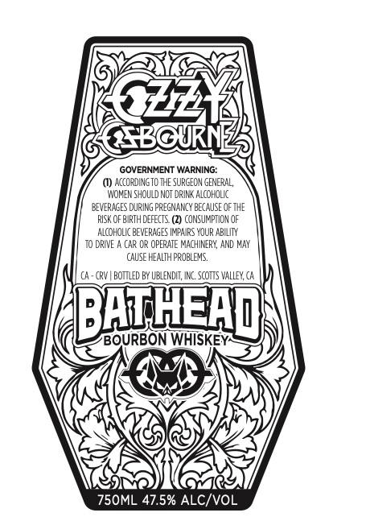
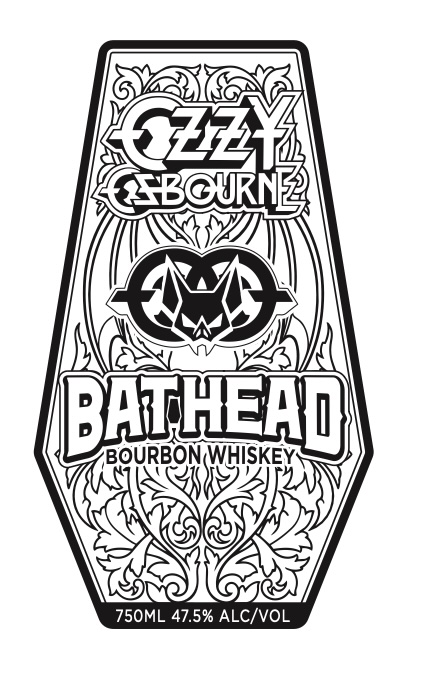

# TTB COLA Label Images - TTBID 26274001000579

**Brand Name:** BATHEAD

**Issue Date:** 10/07/2026

**Origin Code:** 01

**Product Class/Type:** 101

**Source:** [TTB Public COLA Registry](https://ttbonline.gov/colasonline/viewColaDetails.do?action=publicFormDisplay&ttbid=26274001000579)

## Label Images

### Back Label

### Front Label

## Extracted Label Text

*Text extracted via OCR - may contain errors*

*1 image(s) excluded: text did not meet readability threshold*

**Detected Proof:** 95

### Back Label

Ozz
@TBOURN
GOVERNMENT WARNING:
ACCCRDINGTO THE SURCECN GENERAL,
WOMER SHOULD NOT DRIRI AICOH DLC
BEVERAGES DURI & PREGMARCY BECAUSE OF THE
RISK OF BIRTH DEFECTS (2) CONS UMAPTICN OF
ALCOHDLIC BEVERAGES IMPAIRS YDUR ABILITY
T0 DRIVE
CAR OR OPERATE MACHIRER", AND MaY
CAUSE HEALTH PROBLEMS.
CRV | BOTTLED BY UBLENDLT, IRC ScOTTS WALLEY, Cr
BATHEAQ
BOURBON WHISKEY
750ML 47.5% ALC/VOL
