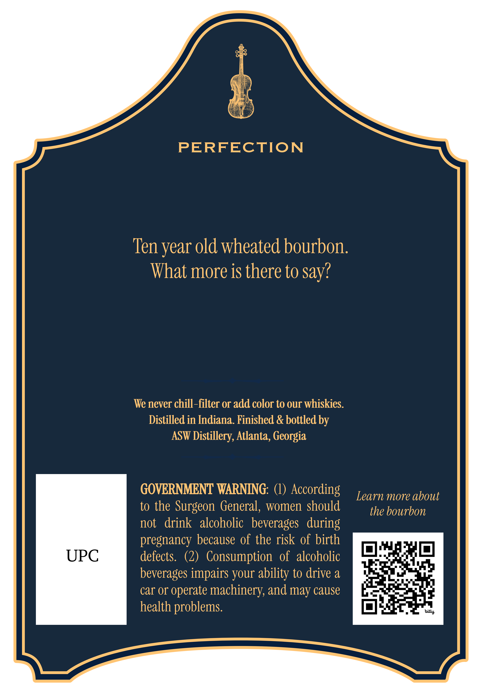
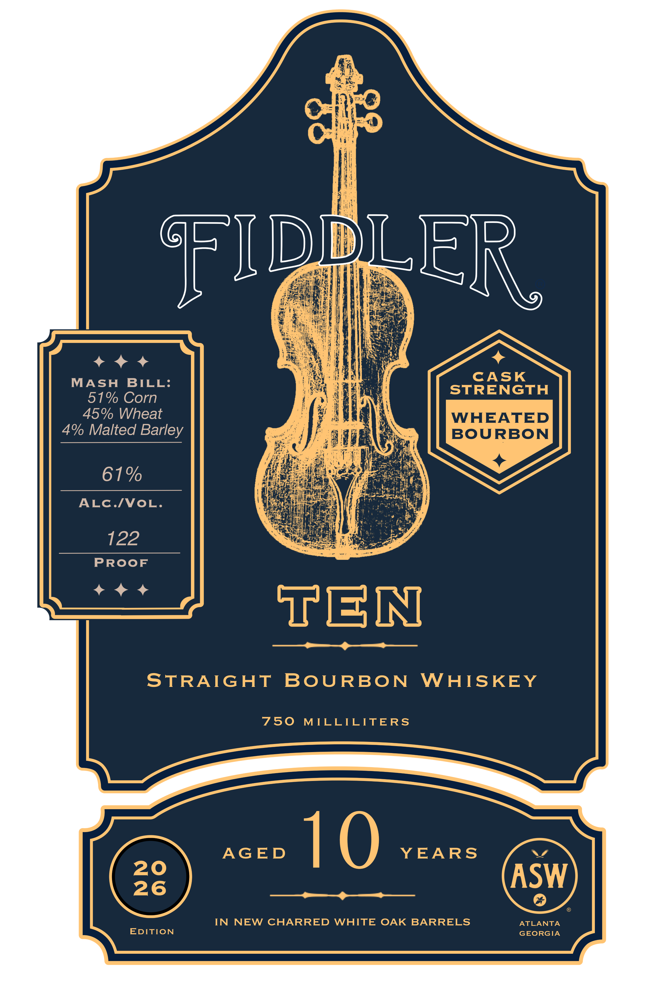

# TTB COLA Label Images - TTBID 26275001000164

**Brand Name:** FIDDLER

**Fanciful Name:** TEN

**Issue Date:** 10/07/2026

**Origin Code:** 08

**Product Class/Type:** 101

**Source:** [TTB Public COLA Registry](https://ttbonline.gov/colasonline/viewColaDetails.do?action=publicFormDisplay&ttbid=26275001000164)

## Label Images

### Back Label

### Front Label

## Extracted Label Text

*Text extracted via OCR - may contain errors*

**Detected Proof:** 122
**Detected Age:** 10 Years

### Back Label

PERFECTION
Ten year old wheated bourbon:
What more is there to Say?
We never chill-filter or add color to our whiskies.
Distilled in Indiana_ Finished & bottled by
ASW Distillery, Atlanta, Georgia
GOVERNMENT WARNING:
According
Learn more about
to the Surgeon  General, women should
the bourbon
not
drink   alcoholic   beverages   during
pregnancy because of the risk of birth
UPC
defects.  (2)   Consumption   of  alcoholic
beverages impairs your ability to drive &
car or
operate machinery, and may cause
health problems.
bitly

### Front Label

FIDDLER_
CASK
MASH
BILL:
STRENGTH
51% Corn
45% Wheat
WHEATED
4% Malted Barley
BOURBON
61%
ALC./VoL.
122
PROoF
TEN
STRAIGHT
BoURBON
WHISKEY
750
MILLILITERS
AGED
10
YEARS
20
ASW
26
IN
NEW CHARRED WHITE OAK BARRELS
ATLANTA
EDITION
GEORGIA
