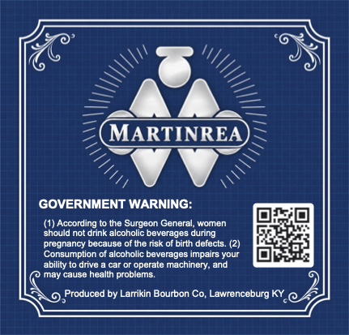
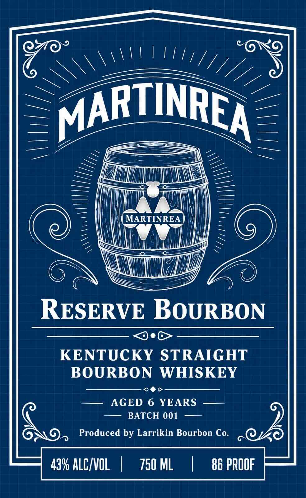
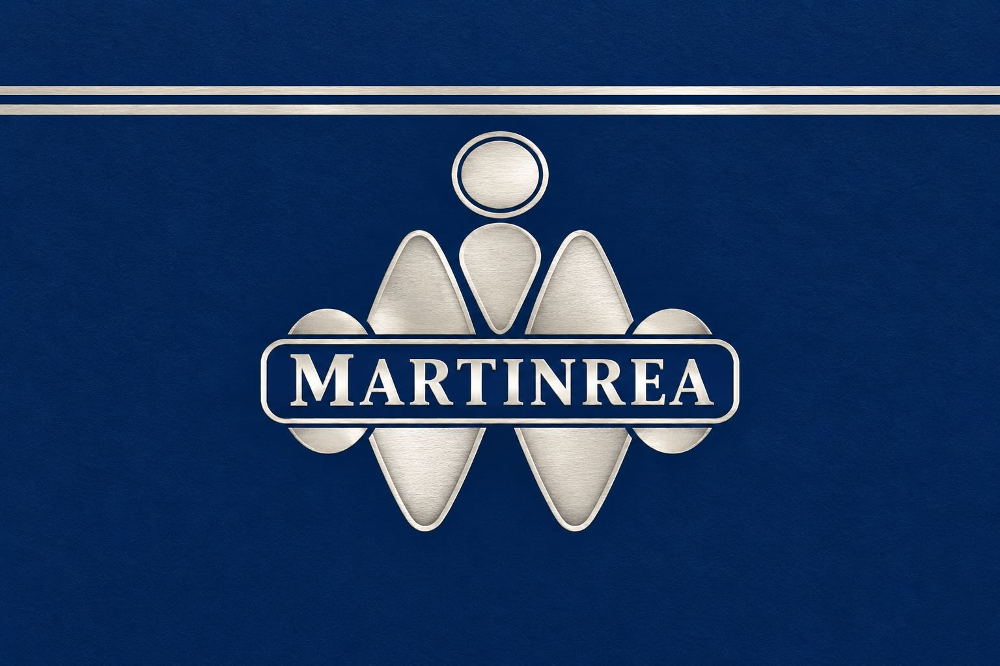

# TTB COLA Label Images - TTBID 26275001000225

**Brand Name:** LARRIKIN BOURBON CO.

**Fanciful Name:** RESERVE BOURBON

**Issue Date:** 10/07/2026

**Origin Code:** 22

**Product Class/Type:** 101

**Source:** [TTB Public COLA Registry](https://ttbonline.gov/colasonline/viewColaDetails.do?action=publicFormDisplay&ttbid=26275001000225)

## Label Images

### Back Label

### Front Label

### Label 2

## Extracted Label Text

*Text extracted via OCR - may contain errors*

*1 image(s) excluded: text did not meet readability threshold*

**Detected Proof:** 86
**Detected Age:** 6 Years

### Back Label

MARTINREA
GOVERNMENT WARNING:
(1) According
the Surgeon General;,
Women
should not drink
lcoholic beverages during
pregnancy because
the risk
birth defects
Consumption of alcoholic beverages impairs your
ability
drive
operate machinery, and
cause health problems
Produced by Larrikin Bourbon Co; Lawrenceburg KY @

### Front Label

MARTINREA
MARTINREA
RESERVE BOURBON
KENTUCKY STRAIGHT
BOURBON
WHISKEY
AGED 6 YEARS
BATCH 001
Produced by Larrikin Bourbon Co.
439 ALCIVOL
750 ML
86 PROOF
