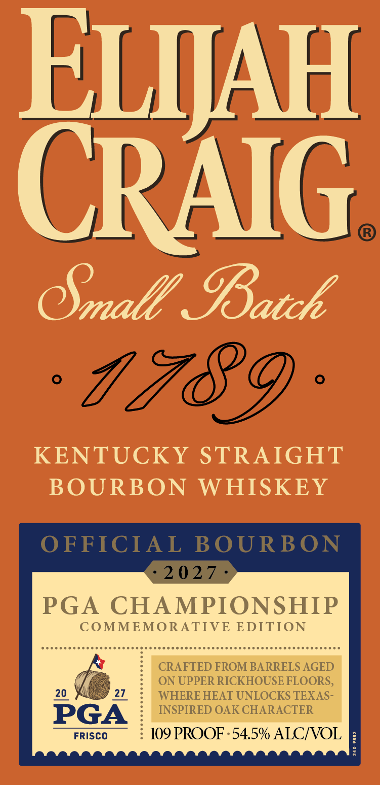
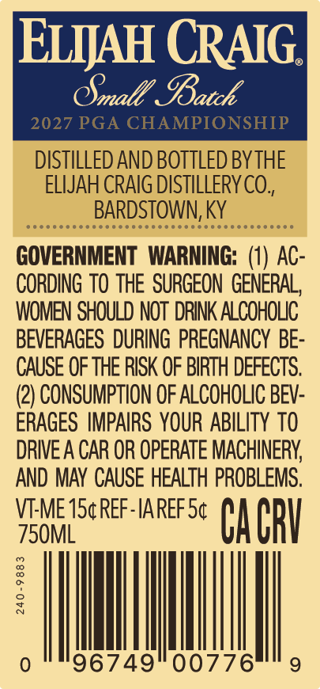
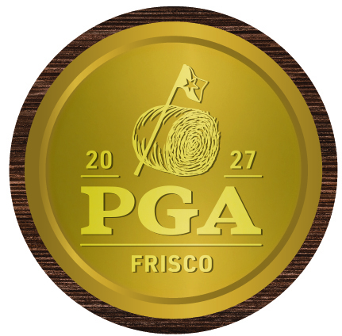

# TTB COLA Label Images - TTBID 26275001000299

**Brand Name:** ELIJAH CRAIG

**Fanciful Name:** ELIJAH CRAIG 2027 PGA CHAMPIONSHIP COMMEMORATIVE EDITION

**Issue Date:** 10/07/2026

**Origin Code:** 22

**Product Class/Type:** 101

**Source:** [TTB Public COLA Registry](https://ttbonline.gov/colasonline/viewColaDetails.do?action=publicFormDisplay&ttbid=26275001000299)

## Label Images

### Label 1

### Label 2

### Label 3

### Label 4

## Extracted Label Text

*Text extracted via OCR - may contain errors*

*2 image(s) excluded: text did not meet readability threshold*

**Detected Proof:** 109

### Label 1

ELIJAH
CRAIG
Omall IBatch
1789
KENTUCKY
STRAIGHT
BOURBON
WHISKEY
OFFICIAL
BOURBON
2 0 27
PGA
CHAMPIONSHIP
COMMEMORATIVE EDITION
CRAFTED FROM BARRELS AGED
ON UPPER RICKHOUSE FLOORS,
20
27
WHERE HEAT UNLOCKS TEXAS -
PGA
INSPIRED OAK CHARACTER
FRISCO
109 PROOF. 54.5% ALCIVOL
:
8

### Label 2

EIJAH CRAIG
Omall IBatch
2027 PGA CHAMPIONSHIP
DISTILLED AND BOTTLED BYTHE
ELIJAH CRAIG DISTILLERYCO:
BARDSTOWN; KY
(
GOVERNMENT WARNING:
Ac:
CORDING TO THE   SURGEON  GENERAL,
WOMEN SHOULD NOT DRINK ALCOhOLc
BEVERAGES DURING PREGNANCY BE-
CAUSE OF THE RISK OF BIRTH DEFECTS.
(2) CONSUMPTION OF ALCOHOLIC BEV-
ERAGES IMPAIRS YOUR ABILITY TO
DRIVE A CAR OR OPERATE MACHINERY
AND MAY CAUSE HEALTH PROBLEMS,
VTME 1S4REF-IAREF St
CacbV
750ML
3
8
96749
00776
