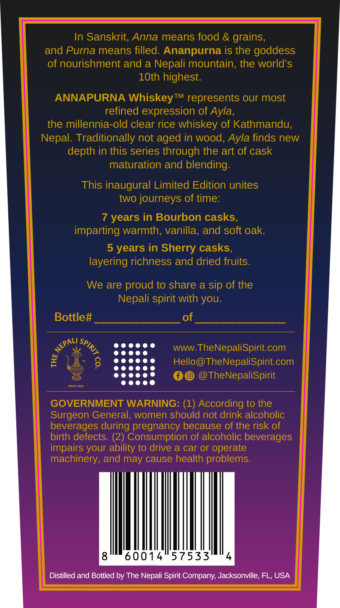
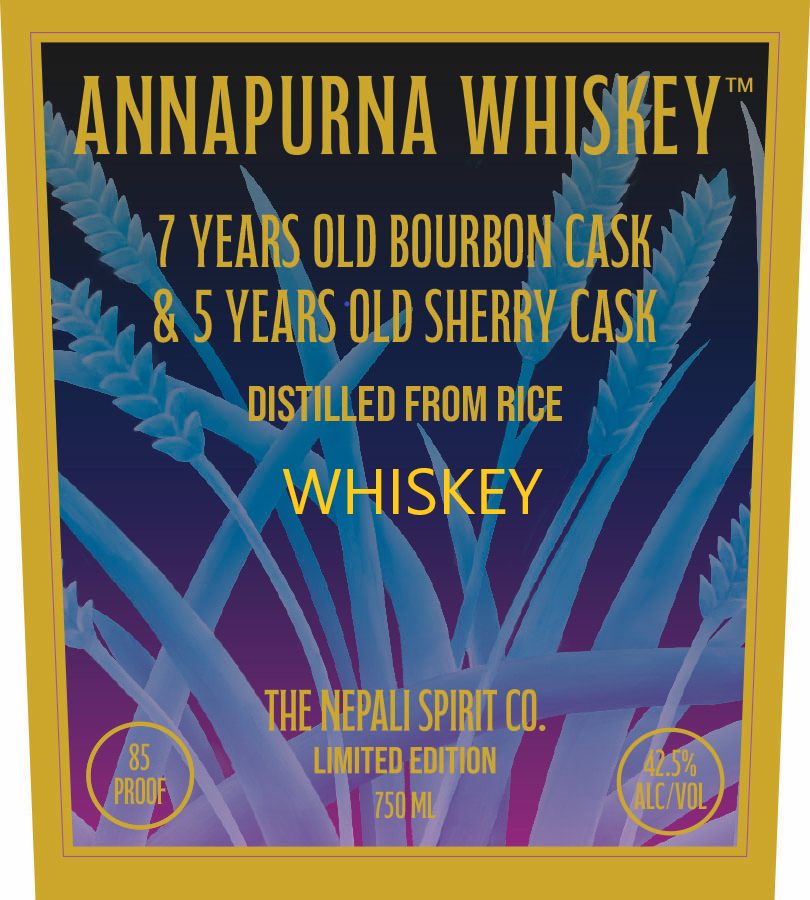

# TTB COLA Label Images - TTBID 26275001000347

**Brand Name:** ANNAPURNA WHISKEY

**Issue Date:** 10/07/2026

**Origin Code:** 16

**Product Class/Type:** 140

**Source:** [TTB Public COLA Registry](https://ttbonline.gov/colasonline/viewColaDetails.do?action=publicFormDisplay&ttbid=26275001000347)

## Label Images

### Back Label

### Front Label

## Extracted Label Text

*Text extracted via OCR - may contain errors*

**Detected Age:** 7 Years

### Back Label

In Sanskrit; Anna means food & grains;
and Purna means filled: Ananpurna is the goddess
of nourishment and a Nepali mountain; the world'S
10th highest:
ANNAPURNA WhiskeyTM represents our most
refined expression of Ayla,
the millennia-old clear rice whiskey of Kathmandu;
Nepal. Traditionally not aged in wood, Ayla finds new
depth in this series through the art of cask
maturation and blending:
This inaugural Limited Edition unites
two journeys of time:
7 years in Bourbon casks,
imparting warmth, vanilla, and soft oak.
5 years in Sherry casks,
layering richness and dried fruits.
We are proud to share a sip of the
Nepali spirit with you:
Bottle#t
of
WWW
TheNepaliSpirit com
1
8
Hello@TheNepaliSpiritcom
TheNepaliSpirit
Sincn20zi
GOVERNMENT WARNING: (1) According to the
Surgeon General, women should not drink alcoholic
beverages during pregnancy because of the risk of
birth defects. (2) Consumption of alcoholic beverages
impairs your ability t0 drive a car or operate
machinery, and may cause health problems:
8
60014
57533
Distilled and Bottled by The Nepali Spirit Company; Jacksonville, FL, USA
NEPALI
SPIRIT <

### Front Label

TM
ANNAPURNA WHISKEY
7 VEARS OLD BOURBON CaSk
5 VEARS OLD SHERRV CaSk
DISTILLED FROM RICE
WHISKEY
THE NEPALI SPIRIT CO.
85
LIMITED EDITION
42.5%6
PROOF
750 ML
ALC/VOL
