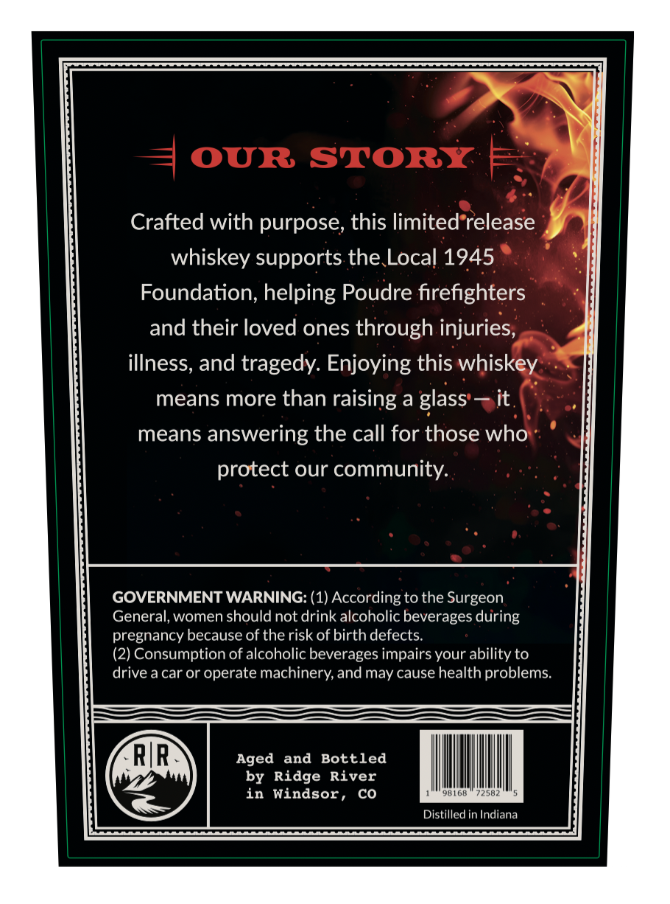
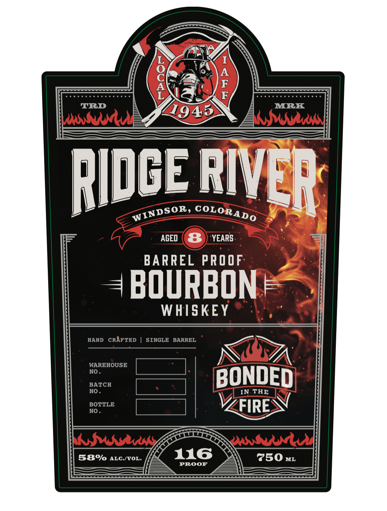

# TTB COLA Label Images - TTBID 26275001000372

**Brand Name:** RIDGE RIVER

**Fanciful Name:** LOCAL IAFF 1945

**Issue Date:** 10/07/2026

**Origin Code:** 13

**Product Class/Type:** 141

**Source:** [TTB Public COLA Registry](https://ttbonline.gov/colasonline/viewColaDetails.do?action=publicFormDisplay&ttbid=26275001000372)

## Label Images

### Back Label

### Front Label

## Extracted Label Text

*Text extracted via OCR - may contain errors*

**Detected Proof:** 116
**Detected Age:** 8 Years

### Back Label

OUR STORY
Crafted with purpose; this limited release
whiskey supports the Local 1945
Foundation, helping Poudre firefighters
and their loved ones through injuries,
illness, and tragedy: Enjoying this whiskey
means more than raising a glass
it
means
answering the call for those who
protect our community:
GOVERNMENT WARNING: (1) According to the Surgeon
General, women should not drink alcoholic beverages during
pregnancy because of the risk of birth defects.
(2) Consumption of alcoholic beverages impairs your ability to
drive a car or operate machinery,and may cause health problems:
RIR`
Aged
and
Bottled
by Ridge River
in Windsor ,
Co
98168
72582
Distilled in Indiana

### Front Label

6
'
TRD
MRK
buuwu
1945
Ksaws
RIDCE_
AGED
8
YEARS
BARREL PROOF
BOURBON
WHISKEY
HAND
CRAFTED
SINGLE
BARREL
WAREHOUSE
NO
BATCH
BONDED
NO
IN THE
BOTTLE
FIRE
NO
KSwn
esn
58%
ALC /VOL.
116
750 ML
PROOF
RIEA
WINDSOR,
COLORADO
